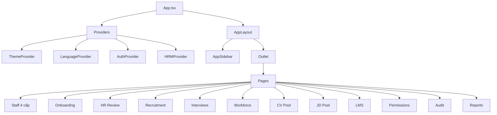

# Architecture Overview

Appota HRM được xây dựng theo kiến trúc **client-side SPA** với React 18 \+ TypeScript \+ Vite. Hệ thống hiện sử dụng **mock data** cho development, sẵn sàng tích hợp Supabase hoặc REST API.

## Sơ đồ tổng quan

```text
┌─────────────────────────────────────────────────────────┐
│                    Browser (SPA)                         │
│                                                          │
│  ┌────────────────────────────────────────────────────┐ │
│  │            App.tsx (Root + Providers)              │ │
│  │  ┌──────────────────────────────────────────────┐  │ │
│  │  │  AuthProvider │ ThemeProvider │ LangProvider  │  │ │
│  │  │  HRMProvider  │ QueryClient (future)         │  │ │
│  │  └──────────────────────────────────────────────┘  │ │
│  │  ┌──────────────────────────────────────────────┐  │ │
│  │  │   <Outlet /> — Route content                  │  │ │
│  │  │   (rendered by React Router v7)               │  │ │
│  │  └──────────────────────────────────────────────┘  │ │
│  └────────────────────────────────────────────────────┘ │
└─────────────────────┬───────────────────────────────────┘
                      │
                      │ (future: HTTPS / SSE)
                      ▼
┌─────────────────────────────────────────────────────────┐
│              Backend (Supabase / REST)                   │
│  - Auth (Supabase Auth)                                 │
│  - Database (Postgres)                                  │
│  - Storage (CV files, avatars)                          │
│  - Realtime subscriptions                               │
└─────────────────────────────────────────────────────────┘
```

## Layers

<CardGroup cols={3}>
  <Card title="Presentation" icon="window">
    React components (pages, layouts, UI primitives)
  </Card>

  <Card title="State" icon="database">
    Context API (HRM, Auth, Theme, Language)
  </Card>

  <Card title="Data" icon="server">
    Mock data \+ future API client
  </Card>
</CardGroup>

## Module Organization



## Routing

React Router v7 với `RouteConfig[]` khai báo trong `src/routes.tsx`:

```typescript
export const routes: RouteConfig[] = [
  { path: '/', element: <DashboardPage /> },
  { path: '/staff', element: <StaffListPage /> },
  { path: '/staff/:id', element: <StaffDetailPage /> },
  // ...
];
```

Xem chi tiết tại [Routing](/architecture/routing).

## State Management

Hệ thống dùng **Context API** thay vì Redux/Zustand để giữ bundle nhỏ:

```mermaid
graph LR
  H[HRMContext] --> A[StaffProfile[]]
  H --> B[approveProfile]
  H --> C[rejectProfile]
  H --> D[addActivity]

  T[ThemeContext] --> E[theme]
  T --> F[toggleTheme]

  L[LanguageContext] --> G[t]
  L --> H2[lang]
  L --> I[setLang]

  AU[AuthContext] --> J[currentUser]
  AU --> K[login]
  AU --> L2[logout]
```

Xem chi tiết tại [State Management](/architecture/state-management).

## Data Flow Pattern

### Onboarding Flow

```text
InviteDialog (HR)
  → Generate crypto.randomUUID()
  → Send link to candidate
OnboardingForm (Candidate)
  → Fill 3 steps
  → Submit → HRMContext.addPendingProfile()
HRReview (HR)
  → Approve / Reject
HRMContext
  → updateProfileStatus()
StaffList
  → Filter status === 'approved'
```

### Recruitment Order Flow

```text
Leader tạo Order (DRAFT)
  → Submit (SUBMITTED)
HR Review
  → Approve → JD status = Được phép tuyển
CV Pool
  → Apply for JD
Interview
  → Tạo session, chấm điểm
Offer → Hired
```

## Tech Stack

| Layer | Tech |
| --- | --- |
| Framework | React 18 \+ TypeScript |
| Build | Vite (rolldown-vite) |
| Styling | Tailwind CSS v3 \+ shadcn/ui (Radix UI) |
| Routing | React Router v7 |
| Forms | React Hook Form \+ Zod |
| Charts | Recharts |
| Linter | Biome |
| Backend (optional) | Supabase |

Xem chi tiết tại [Tech Stack](/architecture/tech-stack).

## Mock Data

Mọi nghiệp vụ chạy với **mock data** trong `src/data/`:

- 800-1500 nhân viên (Appota Group)
- 30\+ CV ứng viên
- 15\+ JD
- 5-6 buổi phỏng vấn với transcript \+ AI scores
- 150-200 audit entries

## Liên kết

<CardGroup cols={2}>
  <Card title="Tech Stack" icon="layer-group" href="/architecture/tech-stack">
    Chi tiết stack.
  </Card>

  <Card title="Data Model" icon="diagram-project" href="/architecture/data-model">
    Domain types.
  </Card>

  <Card title="Routing" icon="route" href="/architecture/routing">
    Route configuration.
  </Card>

  <Card title="State Management" icon="database" href="/architecture/state-management">
    Context API.
  </Card>
</CardGroup>