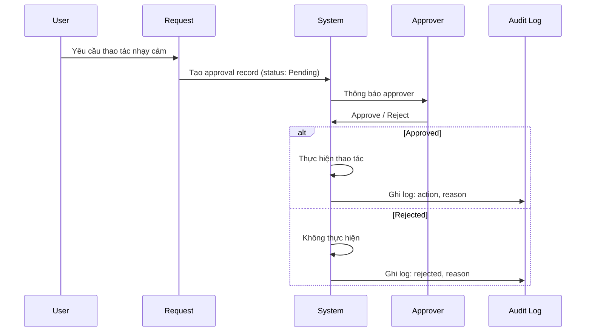

# Approval Records

Module B3 (P1) — Một số thao tác nhạy cảm cần approval trước khi thực hiện. Hệ thống tạo **approval record** với status `Pending`, sau đó approver xử lý.

## Thao tác nhạy cảm cần approval

- **Shortlist** CV — chuyển `Screening → Shortlisted`
- **Chuyển vòng phỏng vấn** — chuyển `Shortlisted → Interview Scheduled`
- **Gửi offer** — chuyển `Interview Completed → Offer Sent`
- **Reject** CV ở stage sau — chuyển sang `Rejected`

## Approval Flow



## Data Model

```typescript
interface ApprovalRecord {
  id: string;
  requestBy: string;          // Người yêu cầu
  requestByName: string;
  approvedBy?: string;        // Người phê duyệt (sau khi xử lý)
  approvedByName?: string;
  action: ApprovalAction;     // 'shortlist' | 'next_round' | 'send_offer' | 'reject'
  cvId: string;               // CV liên quan
  status: 'Pending' | 'Approved' | 'Rejected';
  timestamp: Date;            // Thời điểm yêu cầu
  processedAt?: Date;         // Thời điểm xử lý
  reason?: string;            // Lý do (bắt buộc khi reject)
}
```

## Approver

Theo mặc định:

- **HR Manager** có thể approve tất cả
- **Leader** có thể approve trong **phòng ban của mình**
- **Super Admin** có thể approve bất kỳ

## Hiển thị trong CV Detail

Trong **CV Detail** tab, section **Approval Records** hiển thị:

```text
┌─────────────────────────────────────────────────┐
│ Approval Records                                │
├─────────────────────────────────────────────────┤
│ [2026-05-20] Shortlist                          │
│ Request by: Nguyễn Văn A                        │
│ Status: ✓ Approved by HR Trần Thị B             │
│ Reason: —                                      │
├─────────────────────────────────────────────────┤
│ [2026-05-21] Send Offer                         │
│ Request by: Nguyễn Văn A                        │
│ Status: ⏳ Pending                              │
│ Reason: Ứng viên phù hợp với JD #1234          │
└─────────────────────────────────────────────────┘
```

## Validation

| Trường hợp | Xử lý |
| --- | --- |
| Yêu cầu approval khi không có approver | Hiển thị lỗi **"No approver available"** |
| Approval pending quá lâu (\> 7 ngày) | Cảnh báo **"Approval pending for X days"** |
| Approver không đúng phòng ban | Hiển thị **"Access denied"** |
| Lý do reject trống | Nút Reject bị disable |

## Code Reference

- Approval model: `src/types/approval.ts`
- Approval flow: `src/lib/approval.ts`
- UI section: trong `CVDetail` component

## Liên kết

<CardGroup cols={2}>
  <Card title="CV Pool" icon="address-book" href="/modules/recruitment/cv-pool">
    Tài liệu CV Pool.
  </Card>

  <Card title="CV Transitions" icon="arrows-turn-right" href="/business-rules/cv-status-transitions">
    Transition map.
  </Card>
</CardGroup>