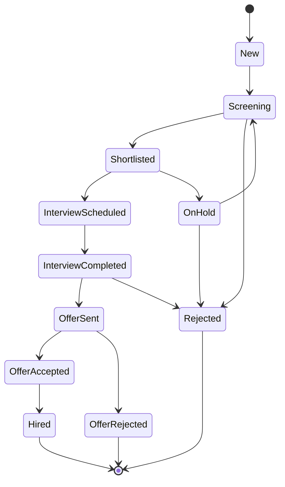

# CV Status Transitions

Module B1 (P1) — Quy định transition hợp lệ giữa các trạng thái CV trong pipeline tuyển dụng.

## Transition Map



## Bảng transition

| From | To | Mô tả |
| --- | --- | --- |
| **New** | Screening | Bắt đầu sàng lọc |
| **Screening** | Shortlisted | Pass sàng lọc |
| **Screening** | Rejected | Fail sàng lọc |
| **Shortlisted** | InterviewScheduled | Lên lịch phỏng vấn |
| **Shortlisted** | OnHold | Tạm giữ |
| **InterviewScheduled** | InterviewCompleted | Hoàn thành phỏng vấn |
| **InterviewCompleted** | OfferSent | Gửi offer |
| **InterviewCompleted** | Rejected | Từ chối sau phỏng vấn |
| **OfferSent** | OfferAccepted | Ứng viên accept |
| **OfferSent** | OfferRejected | Ứng viên từ chối offer |
| **OfferAccepted** | Hired | Onboard thành công |
| **OnHold** | Screening | Quay lại screening |
| **OnHold** | Rejected | Reject từ on-hold |

## Validation khi chuyển trạng thái

```typescript title="CVTransition.ts"
const isValidTransition = (from: CVStatus, to: CVStatus): boolean => {
  const validTransitions: Record<CVStatus, CVStatus[]> = {
    New: ['Screening'],
    Screening: ['Shortlisted', 'Rejected'],
    Shortlisted: ['InterviewScheduled', 'OnHold'],
    InterviewScheduled: ['InterviewCompleted'],
    InterviewCompleted: ['OfferSent', 'Rejected'],
    OfferSent: ['OfferAccepted', 'OfferRejected'],
    OfferAccepted: ['Hired'],
    OfferRejected: [],
    Hired: [],
    Rejected: [],
    OnHold: ['Screening', 'Rejected'],
  };

  return validTransitions[from]?.includes(to) ?? false;
};
```

## Kanban Drag-drop

Khi user kéo CV từ column này sang column khác:

<Steps>
  <Step title="Validate transition rule">
    Gọi `isValidTransition(from, to)`.
  </Step>
  <Step title="Nếu hợp lệ">
    Gọi API chuyển trạng thái và ghi log.
  </Step>
  <Step title="Nếu không hợp lệ">
    Hiển thị thông báo **"Invalid transition"** — không cho phép chuyển.
  </Step>
</Steps>

## Ghi log khi chuyển trạng thái

```typescript
interface CVStatusChangeLog {
  id: string;
  cvId: string;
  actor: string;
  fromStatus: CVStatus;
  toStatus: CVStatus;
  timestamp: Date;
  reason?: string;
}
```

## AI Matching Logic

```typescript
const calculateMatchScore = (cv: CV, jd: JD): MatchScore => {
  const skillScore = matchSkills(cv.skills, jd.requiredSkills);    // %
  const expScore = matchExperience(cv.experience, jd.minExperience); // %
  const eduScore = matchEducation(cv.education, jd.preferredEducation); // %
  const posScore = matchPreviousPosition(cv.previousPositions, jd.title); // %

  const total = (skillScore * 0.4) + (expScore * 0.3)
              + (eduScore * 0.15) + (posScore * 0.15);

  return {
    total,
    breakdown: { skills: skillScore, experience: expScore, education: eduScore, previousPosition: posScore },
    reasons: generateReasons(skillScore, expScore, eduScore, posScore),
  };
};
```

## Edge Cases

| Tình huống | Xử lý |
| --- | --- |
| Drag-drop không hợp lệ | Hiển thị **"Invalid transition"** |
| Tạo InterviewSession khi JD không được phép tuyển | API lỗi `JD_NOT_ALLOWED` |
| AI Matching không tìm thấy CV | **"No matching CVs found"** |
| Bulk update nhiều CV | Validate từng cái, fail-fast nếu có invalid |

## Code Reference

- CV Pool: `src/pages/CVPoolPage.tsx`
- Kanban: drag-drop component trong `src/components/cv/`
- Transition validator: `src/lib/cvTransitions.ts`

## Liên kết

<CardGroup cols={2}>
  <Card title="CV Pool" icon="address-book" href="/modules/recruitment/cv-pool">
    Tài liệu CV Pool.
  </Card>

  <Card title="JD Status Rules" icon="gavel" href="/business-rules/jd-status-rules">
    Quy tắc JD.
  </Card>
</CardGroup>