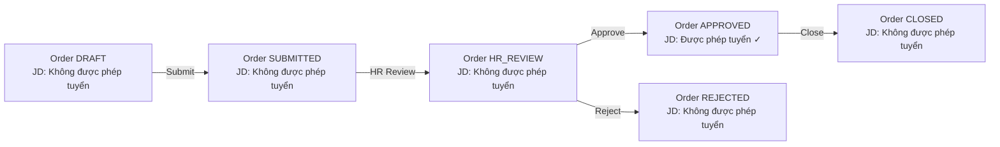

# JD Status Rules

Module A2 (P1) — Quy định JD Status đồng bộ với Recruitment Order và kiểm soát quyền tạo InterviewSession.

## Hai trạng thái JD

<CardGroup cols={2}>
  <Card title="Được phép tuyển" color="#16a34a" icon="check">
    Cho phép tạo InterviewSession, chuyển stage phỏng vấn/offer.
  </Card>

  <Card title="Không được phép tuyển" color="#dc2626" icon="ban">
    Không cho phép tạo InterviewSession, không chuyển stage phỏng vấn/offer. API trả lỗi `JD_NOT_ALLOWED`.
  </Card>
</CardGroup>

## Đồng bộ với Recruitment Order



| Order Status | JD Status |
| --- | --- |
| `DRAFT` | Không được phép tuyển |
| `SUBMITTED` | Không được phép tuyển |
| `HR_REVIEW` | Không được phép tuyển |
| `APPROVED` | **Được phép tuyển** |
| `REJECTED` | Không được phép tuyển |
| `CLOSED` | Không được phép tuyển |

## API Error Handling

Khi API nhận yêu cầu thao tác trên JD không được phép tuyển:

```typescript
// POST /api/interviews
if (jd.status !== 'Được phép tuyển') {
  throw new JDNotAllowedError(jd.id);
}
```

```typescript
class JDNotAllowedError extends Error {
  code = 'JD_NOT_ALLOWED';
  constructor(public jdId: string) {
    super(`JD ${jdId} is not allowed for hiring`);
  }
}
```

## Validation ở Frontend

```typescript title="api.ts"
const createInterviewSession = async (jdId: string, payload: InterviewPayload) => {
  const response = await fetch(`/api/interviews`, {
    method: 'POST',
    body: JSON.stringify({ jdId, ...payload }),
  });

  if (response.status === 403) {
    const error = await response.json();
    if (error.code === 'JD_NOT_ALLOWED') {
      toast.error('JD này chưa được phép tuyển. Vui lòng chờ HR approve.');
      return null;
    }
  }

  return response.json();
};
```

## Edge Cases

| Tình huống | Xử lý |
| --- | --- |
| Tạo InterviewSession cho JD không được phép | API lỗi `JD_NOT_ALLOWED`, hiển thị thông báo lỗi |
| Chuyển stage phỏng vấn cho JD không được phép | API lỗi `JD_NOT_ALLOWED`, hiển thị thông báo lỗi |
| Send Offer cho JD không được phép | API lỗi `JD_NOT_ALLOWED`, hiển thị thông báo lỗi |
| Bulk operation trên nhiều JD | Validate từng cái, fail-fast nếu có invalid |
| Đóng order | JD Status chuyển về "Không được phép tuyển" |

## UI Pattern

JD Detail page hiển thị **banner cảnh báo** khi JD Status = "Không được phép tuyển":

```tsx
{jd.status === 'Không được phép tuyển' && (
  <Alert variant="warning">
    <AlertTriangle className="h-4 w-4" />
    <AlertTitle>JD chưa được phép tuyển</AlertTitle>
    <AlertDescription>
      JD này cần HR approve order trước khi có thể tạo InterviewSession hoặc
      chuyển stage phỏng vấn/offer.
    </AlertDescription>
  </Alert>
)}
```

## Liên kết

<CardGroup cols={2}>
  <Card title="JD Pool" icon="file-contract" href="/modules/recruitment/jd-pool">
    Tài liệu JD Pool.
  </Card>

  <Card title="Recruitment Order" icon="clipboard-list" href="/business-rules/recruitment-order">
    Workflow order.
  </Card>
</CardGroup>