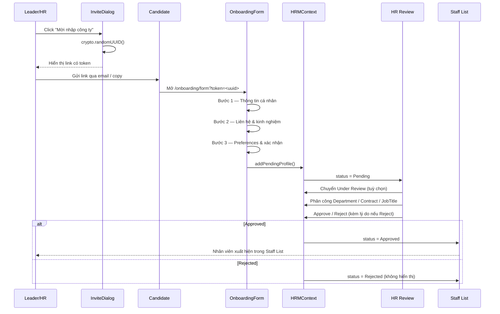

# Onboarding Flow

Quy trình onboarding nhân viên mới gồm 7 bước, đảm bảo HR kiểm soát được việc bổ sung nhân sự vào hệ thống.

## Quy trình 7 bước



## Trạng thái hồ sơ

```typescript
type StaffStatus = 'Pending' | 'Under Review' | 'Approved' | 'Rejected';
```

| Status | Ý nghĩa |
| --- | --- |
| **Pending** | Mới submit, chưa được xem xét |
| **Under Review** | HR đang xem xét |
| **Approved** | Đã phê duyệt, nhân viên chính thức |
| **Rejected** | Bị từ chối (kèm lý do) |

## Phân công khi Approve

Bắt buộc phải phân công trước khi approve:

- **Department**: Engineering, Marketing, Sales, HR, Finance, Operations, Design, Product
- **Contract Type**: Full-time, Part-time, Contractor, Intern
- **Job Title**: tự do (ví dụ: Software Engineer, Marketing Specialist)

## Quy tắc quan trọng

<Steps>
  <Step title="Token bảo mật">
    Token được sinh bằng `crypto.randomUUID()` — không lưu database, chỉ dùng để định danh ứng viên.
  </Step>
  <Step title="HR có thể chuyển Under Review">
    Status có thể chuyển `Pending → Under Review` khi HR đang xem xét.
  </Step>
  <Step title="Reject bắt buộc nhập lý do">
    Khi Reject, lý do là **bắt buộc** và được lưu vào audit log.
  </Step>
  <Step title="Approved xuất hiện ngay">
    Khi Approved, nhân viên xuất hiện ngay trong Staff List và được tính vào `activeStaffList`.
  </Step>
</Steps>

## Validation

| Trường hợp | Xử lý |
| --- | --- |
| Submit thiếu thông tin bắt buộc | Hiển thị lỗi, yêu cầu điền đầy đủ |
| Upload avatar sai định dạng | Hiển thị lỗi |
| HR Reject không nhập lý do | Nút Reject bị disable cho đến khi nhập |
| Không có hồ sơ trong Pending Table | Hiển thị **"No pending applications"** |

## Code Reference

- Component Onboarding Form: `src/pages/OnboardingFormPage.tsx`
- HRMContext API: `src/contexts/HRMContext.tsx`
- Pending Table: `src/pages/HRPendingPage.tsx`
- Review Detail: `src/pages/HRReviewDetailPage.tsx`

## Liên kết

<CardGroup cols={2}>
  <Card title="Onboarding" icon="user-plus" href="/modules/staff/onboarding">
    Tài liệu Onboarding module.
  </Card>

  <Card title="HR Review" icon="user-check" href="/modules/staff/hr-review">
    Tài liệu HR Review module.
  </Card>
</CardGroup>