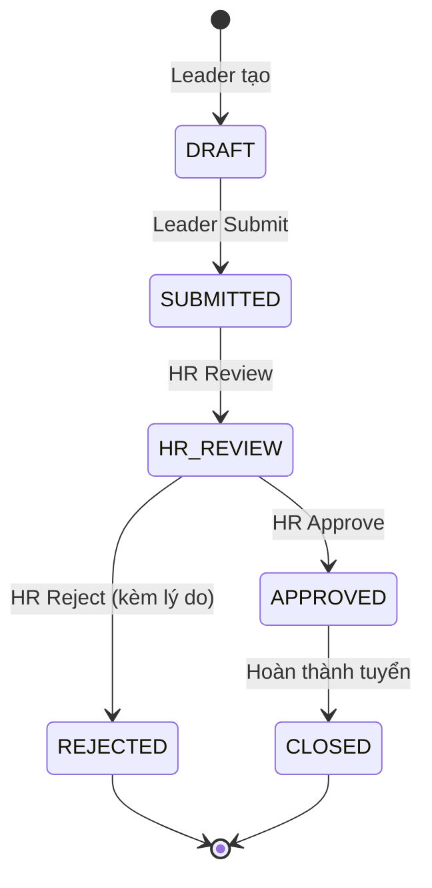

# Recruitment Order Workflow

Quy trình chuẩn hoá cho recruitment order, từ khi Leader tạo nháp đến khi hoàn thành tuyển dụng.

## State Machine



## Chi tiết các bước

<Steps>
  <Step title="Leader tạo order (DRAFT)">
    Status: `DRAFT`. Leader có toàn quyền **Edit**.
  </Step>
  <Step title="Leader Submit (DRAFT → SUBMITTED)">
    Status chuyển sang `SUBMITTED`. **Không thể edit** nữa. Audit log: `actor, timestamp, DRAFT → SUBMITTED`.
  </Step>
  <Step title="HR Review (SUBMITTED → HR_REVIEW)">
    Status chuyển sang `HR_REVIEW`. Audit log: `actor, timestamp, SUBMITTED → HR_REVIEW`.
  </Step>
  <Step title="HR Approve (HR_REVIEW → APPROVED)">
    Status chuyển sang `APPROVED`. **JD Status = Được phép tuyển**. Cho phép tạo InterviewSession. Audit log: `actor, timestamp, HR_REVIEW → APPROVED, JD Status → Được phép tuyển`.
  </Step>
  <Step title="HR Reject (HR_REVIEW → REJECTED)">
    Status chuyển sang `REJECTED`. **Lý do bắt buộc**. Audit log: `actor, timestamp, HR_REVIEW → REJECTED, reason`.
  </Step>
  <Step title="Close (APPROVED → CLOSED)">
    Khi hoàn thành tuyển đủ người. Status: `CLOSED`. Audit log: `actor, timestamp, APPROVED → CLOSED`.
  </Step>
</Steps>

## Audit Log

Mỗi thay đổi trạng thái ghi **audit entry** với:

```typescript
interface AuditEntry {
  id: string;
  orderId: string;
  actor: string;
  timestamp: Date;
  fromStatus: OrderStatus;
  toStatus: OrderStatus;
  reason?: string;
}
```

### Format audit log

```text
[2026-05-20 10:30] Nguyễn Văn A: DRAFT → SUBMITTED
[2026-05-20 14:15] HR Trần Thị B: SUBMITTED → HR_REVIEW
[2026-05-21 09:00] HR Trần Thị B: HR_REVIEW → APPROVED
                    JD Status → Được phép tuyển
```

## Quyền hạn theo trạng thái

| Trạng thái | Hành động khả dụng |
| --- | --- |
| `DRAFT` | Edit, Submit |
| `SUBMITTED` | HR Review |
| `HR_REVIEW` | Approve, Reject (kèm lý do) |
| `APPROVED` | Close |
| `REJECTED` | (Không có) |
| `CLOSED` | (Không có) |

<Warning>
  Cố edit order khi không ở `DRAFT` → lỗi **"Cannot edit order in current status"**.
</Warning>

## Validation

| Trường hợp | Xử lý |
| --- | --- |
| Tạo order thiếu thông tin bắt buộc | Hiển thị lỗi, yêu cầu điền đầy đủ |
| Edit order không ở `DRAFT` | Hiển thị **"Cannot edit order in current status"** |
| HR Reject không nhập lý do | Nút Reject bị disable |
| Không có order | Hiển thị **"No recruitment orders found"** |
| Filter không có kết quả | Hiển thị **"No results found"** |

## Mock Data

<Note>
  - 10\+ recruitment order
  - Đa dạng trạng thái: DRAFT, SUBMITTED, HR\_REVIEW, APPROVED, REJECTED, CLOSED
  - Audit log đầy đủ cho mỗi order
</Note>

## Liên kết

<CardGroup cols={2}>
  <Card title="Recruitment Orders" icon="clipboard-list" href="/modules/recruitment/recruitment-orders">
    Tài liệu module.
  </Card>

  <Card title="JD Status Rules" icon="gavel" href="/business-rules/jd-status-rules">
    Quy tắc JD Status.
  </Card>
</CardGroup>