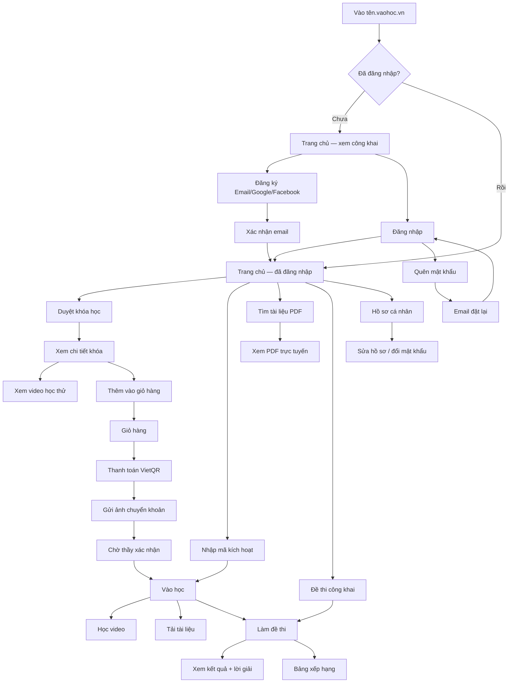
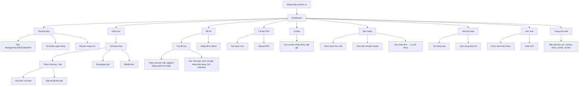

# Flows — Đợt 1 Vaohoc.vn

## Flow học sinh

```mermaid
flowchart TD
    A[Vào tên.vaohoc.vn] --> B{Đã đăng nhập?}
    B -- Chưa --> C[Trang chủ — xem công khai]
    B -- Rồi --> D[Trang chủ — đã đăng nhập]
    C --> E[Đăng ký Email/Google/Facebook]
    E --> F[Xác nhận email]
    F --> D
    C --> G[Đăng nhập]
    G --> D
    D --> H[Duyệt khóa học]
    H --> I[Xem chi tiết khóa]
    I --> J[Xem video học thử]
    I --> K[Thêm vào giỏ hàng]
    K --> L[Giỏ hàng]
    L --> M[Thanh toán VietQR]
    M --> N[Gửi ảnh chuyển khoản]
    N --> O[Chờ thầy xác nhận]
    O --> P[Vào học]
    D --> Q[Nhập mã kích hoạt]
    Q --> P
    P --> R[Học video]
    P --> S[Tải tài liệu]
    P --> T[Làm đề thi]
    T --> U[Xem kết quả + lời giải]
    T --> V[Bảng xếp hạng]
    D --> W[Tìm tài liệu PDF]
    W --> X[Xem PDF trực tuyến]
    D --> Y[Đề thi công khai]
    Y --> T
    D --> Z[Hồ sơ cá nhân]
    Z --> Z1[Sửa hồ sơ / đổi mật khẩu]
    G --> G1[Quên mật khẩu]
    G1 --> G2[Email đặt lại]
    G2 --> G
```

## Flow thầy (quản trị tại vaohoc.vn)

```mermaid
flowchart TD
    A[Đăng nhập vaohoc.vn] --> B[Dashboard]
    B --> C[Thương hiệu]
    C --> C1[Đặt tên/logo/màu/SĐT/Zalo/MXH]
    C --> C2[Tài khoản ngân hàng]
    C --> C3[Banner trang chủ]
    B --> D[Khóa học]
    D --> D1[Tạo/sửa khóa]
    D1 --> D2[Thêm chương + bài]
    D2 --> D3[Dán link YouTube]
    D2 --> D4[Gắn tài liệu/lời giải]
    D1 --> D5[Đặt giá/giá gốc]
    D1 --> D6[Bật/tắt bán]
    B --> E[Đề thi]
    E --> E1[Tạo đề tay]
    E --> E2[Nhập đề từ Word]
    E1 --> E3[Thêm câu hỏi: trắc nghiệm/đúng-sai/trả lời ngắn]
    E1 --> E4[Cài: thời gian, lượt, lời giải, bảng xếp hạng, lịch mở/khóa]
    B --> F[Tài liệu PDF]
    F --> F1[Tạo danh mục]
    F --> F2[Upload PDF]
    B --> G[Combo]
    G --> G1[Tạo combo nhiều khóa, đặt giá]
    B --> H[Đơn hàng]
    H --> H1[Danh sách đơn chờ]
    H --> H2[Xem ảnh chuyển khoản]
    H --> H3[Xác nhận đơn → tự mở khóa]
    B --> I[Mã kích hoạt]
    I --> I1[Tạo hàng loạt]
    I --> I2[Xem trạng thái mã]
    B --> J[Học sinh]
    J --> J1[Danh sách theo khóa]
    J --> J2[Xuất CSV]
    B --> K[Trang chủ web]
    K --> K1[Sắp xếp khu vực: banner, khóa, combo, tài liệu]
```
