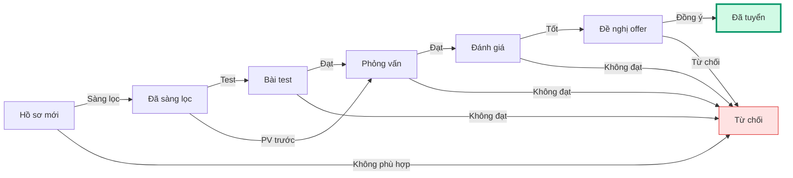
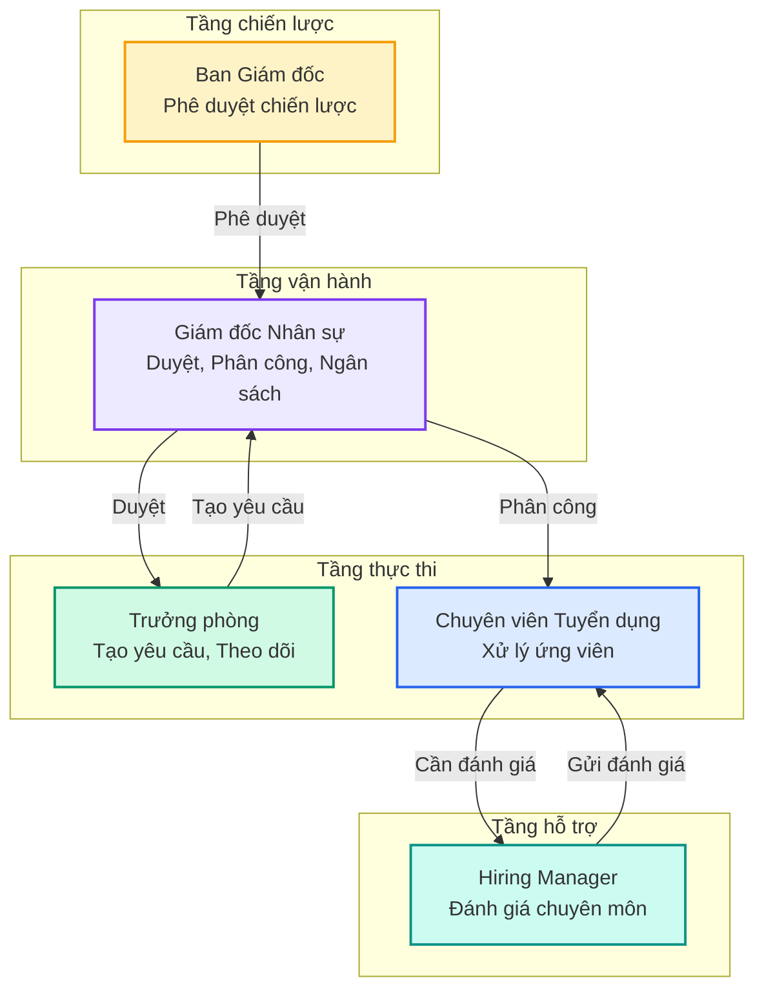

## Thuật ngữ quen thuộc (HRM)

| Thuật ngữ | Nghĩa đơn giản |
| --- | --- |
| **HRM** | Hệ thống quản lý nhân sự |
| **TA** | Chuyên viên Tuyển dụng |
| **HRD** | Giám đốc Nhân sự |
| **BOD** | Ban Giám đốc |
| **HM** | Quản lý tuyển dụng phòng ban |
| **CEO** | Tổng Giám đốc |
| **JD** | Mô tả vị trí công việc |
| **CV** | Hồ sơ ứng viên (sơ yếu lý lịch) |
| **KPI** | Chỉ số đánh giá hiệu suất |
| **OKR** | Mục tiêu và kết quả then chốt |
| **SLA** | Cam kết thời gian xử lý |
| **Onboarding** | Quá trình hội nhập nhân viên mới |
| **Phễu tuyển dụng** | Số ứng viên giảm dần qua các giai đoạn |
| **Lark** | Nền tảng chat nội bộ công ty |
| **ACheckin** | Hệ thống chấm công (nguồn dữ liệu tổ chức) |

---

## Thuật ngữ V1.0 (bổ sung)

| Thuật ngữ | Nghĩa |
| --- | --- |
| **V1.0** | Phiên bản đầu tiên của module Tuyển dụng |
| **Pipeline** | Quy trình ứng viên qua các giai đoạn (sàng lọc → PV → offer → tuyển) |
| **JD Pool** | Kho mô tả vị trí, dùng để clone cho yêu cầu mới |
| **CV Pool** | Kho hồ sơ ứng viên, dùng để tìm kiếm và gắn vào JD |
| **Phân công TA** | HRD chỉ định TA xử lý một yêu cầu cụ thể |
| **Offer** | Thư mời nhận việc gửi cho ứng viên đạt yêu cầu |
| **SLA** | Thời gian xử lý tối đa cho mỗi giai đoạn |
| **Funnel** | Phễu tuyển dụng — số ứng viên giảm dần qua các giai đoạn |

---

## Giai đoạn Pipeline ứng viên

| Giai đoạn | Mô tả | Người xử lý |
| --- | --- | --- |
| **Hồ sơ mới** | Ứng viên vừa nộp hồ sơ, chưa sàng lọc | TA |
| **Đã sàng lọc** | TA đã xem qua CV, đánh giá sơ bộ | TA |
| **Bài test** | Ứng viên làm bài test chuyên môn | TA \+ HM/Leader |
| **Phỏng vấn** | Vòng PV với TA, HRD, hoặc Leader | TA \+ Leader \+ HRD |
| **Đánh giá** | Nhập đánh giá sau PV | TA \+ HM \+ Leader |
| **Đề nghị offer** | Gửi offer cho ứng viên | TA \+ HRD |
| **Đã tuyển** | Ứng viên đồng ý offer | — |
| **Từ chối** | Ứng viên không đạt / từ chối offer | — |

---

## 5 vai trò — Ai làm gì?

---

## Liên hệ hỗ trợ

Khi gặp vấn đề khi sử dụng V1.0:

- **Lark**: Nhắn tin cho HRD hoặc tạo ticket trong group **HRM Support**

<Note>
  💬 Bạn cần giải thích thuật ngữ nào chưa rõ? Liên hệ HRM Support team để bổ sung vào glossary này.
</Note>