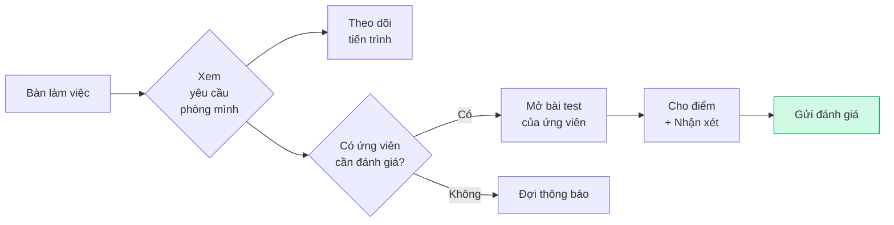

**👤 Chị Mai** — Trưởng phòng Kinh doanh

> _"Mình không tạo yêu cầu tuyển, nhưng mình tham gia đánh giá ứng viên khi được yêu cầu."_

---

## Bạn cần biết (3 điểm chính)

1. **Bạn tham gia đánh giá ứng viên** — Khi TA hoặc HRD cần đánh giá chuyên môn từ bạn
2. **Bạn xem yêu cầu của phòng mình** — Theo dõi tiến trình qua Bàn làm việc
3. **Bạn có quyền hạn chế** — Chỉ một số chức năng, không phải tất cả

---

## Hạn chế hiện tại

<Warning>
  ⚠️ **Lưu ý:** Giao diện HRM đang được tối ưu cho TA và Leader. HM hiện tại chỉ sử dụng Bàn làm việc và chức năng đánh giá. Các tính năng chi tiết hơn đang được phát triển.
</Warning>

---

## Hoạt động của bạn

---

## Quy trình đánh giá ứng viên trong V1.0

<Steps>
  <Step title="Nhận thông báo">
    Khi có ứng viên cần bạn đánh giá, hệ thống gửi thông báo qua email và Lark.
  </Step>
  <Step title="Mở Bàn làm việc">
    Xem ứng viên nào đang chờ đánh giá.
  </Step>
  <Step title="Xem hồ sơ ứng viên">
    - Xem chi tiết kinh nghiệm, kỹ năng
    - Xem lịch sử ứng tuyển (nếu có)
    - Xem bài làm test (nếu có)
  </Step>
  <Step title="Đánh giá">
    - Cho điểm các tiêu chí chuyên môn (theo form có sẵn)
    - Ghi nhận xét về ứng viên
    - Bấm **"Đạt"** hoặc **"Chưa đạt"**
  </Step>
  <Step title="Gửi đánh giá">
    Hệ thống lưu và TA sẽ nhận được để tiếp tục xử lý.
  </Step>
</Steps>

---

## Quyền của bạn trong V1.0

| Chức năng | HM có dùng được? |
| --- | --- |
| Xem yêu cầu tuyển của phòng mình | ✅ Có |
| Xem tiến trình ứng viên (read-only) | ✅ Có |
| Đánh giá chuyên môn ứng viên | ✅ Có |
| Tạo yêu cầu tuyển dụng mới | ❌ Không |
| Duyệt yêu cầu | ❌ Không |
| Phân công TA | ❌ Không |
| Quản lý ngân sách | ❌ Không |
| Cấu hình quy trình | ❌ Không |

---

## Tóm tắt 30 giây

> 🧑‍💼 **Bạn là người "tham gia đánh giá".** Bạn không tạo yêu cầu, không xử lý tuyển, nhưng khi ứng viên cần đánh giá chuyên môn, bạn sẽ nhận thông báo và đánh giá qua HRM.