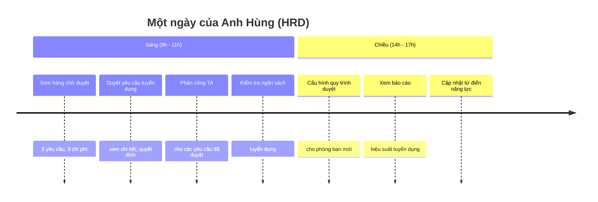
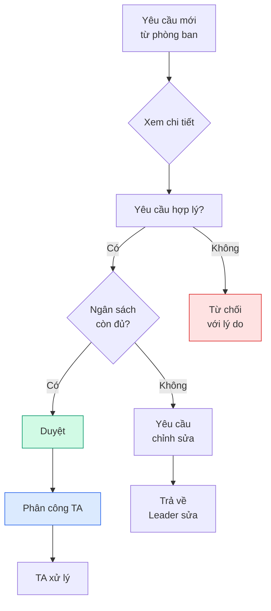
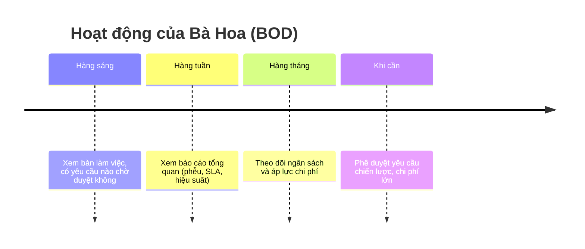
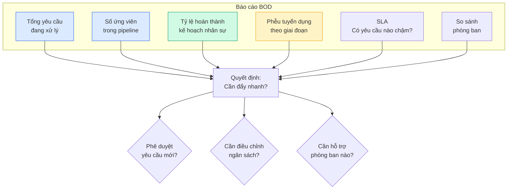

Hai vai trò **HRD (Giám đốc Nhân sự)** và **BOD (Ban Giám đốc)** chia sẻ nhiều quyền hạn trong V1.0: cùng duyệt đơn, cùng xem báo cáo, cùng quản lý chi phí. Trang này gộp hướng dẫn cho cả hai.

<CardGroup cols={2}>
  <Card title="HRD — Anh Hùng" icon="building" href="#hrd">
    Giám đốc Nhân sự — vận hành hệ thống
  </Card>

  <Card title="BOD — Bà Hoa" icon="crown" href="#bod">
    Phó Tổng Giám đốc — quyết định chiến lược
  </Card>

  <Card title="Quy trình duyệt" icon="circle-check" href="#duyet">
    Duyệt yêu cầu cấp 2/cấp 3
  </Card>

  <Card title="Báo cáo & Ngân sách" icon="chart-pie" href="#bao-cao">
    Phễu tuyển dụng, SLA, ngân sách
  </Card>
</CardGroup>

---

## HRD — Giám đốc Nhân sự {#hrd}

**👤 Anh Hùng** — Giám đốc Nhân sự

> _"Mình đảm bảo mọi quy trình nhân sự chạy đúng và mọi người đều có thông tin cần thiết."_

### Bạn cần biết (3 điểm chính)

1. **Bạn duyệt tất cả yêu cầu tuyển dụng** — Là người duyệt cuối cùng trước khi phân công TA
2. **Bạn phân công TA** — Chọn chuyên viên phù hợp cho từng yêu cầu
3. **Bạn quản lý ngân sách** — Theo dõi chi phí tuyển dụng, cảnh báo khi sắp vượt

### Bạn KHÔNG cần biết

- ❌ Chi tiết pipeline ứng viên (TA xử lý)
- ❌ Cách AI đánh giá hồ sơ
- ❌ Cấu hình database

### Một ngày của bạn

### Quy trình duyệt (visual)

---

## BOD — Ban Giám đốc {#bod}

**👤 Bà Hoa** — Phó Tổng Giám đốc

> _"Mình cần nhìn tổng quan và ra quyết định chiến lược — không cần biết chi tiết từng ứng viên."_

### Bạn cần biết (3 điểm chính)

1. **Bạn phê duyệt yêu cầu chiến lược** — Các yêu cầu lớn, vị trí cấp cao, mức lương cao
2. **Bạn xem báo cáo tổng quan** — Phễu tuyển dụng, ngân sách, hiệu suất toàn công ty
3. **Bạn phê duyệt chi phí lớn** — Headhunter, sự kiện tuyển dụng lớn

### Bạn KHÔNG cần biết

- ❌ Chi tiết từng ứng viên (TA và HRD xử lý)
- ❌ Cách hệ thống vận hành
- ❌ Cấu hình chi tiết

### Hoạt động của bạn

### Báo cáo tổng quan bạn thấy

---

## 6 việc HRD làm thường xuyên

| Việc | Bạn làm gì | Tần suất |
| --- | --- | --- |
| ✅ **Duyệt yêu cầu** | Xem chi tiết, quyết định Duyệt/Sửa/Từ chối | Hàng ngày |
| 👥 **Phân công TA** | Chọn TA phù hợp dựa trên phòng ban, workload | Hàng ngày |
| 💰 **Quản lý ngân sách** | Theo dõi chi tiêu, cảnh báo vượt ngân sách | Hàng tuần |
| ⚙️ **Cấu hình quy trình** | Thiết lập luồng duyệt cho phòng ban mới | Khi cần |
| 📊 **Xem báo cáo** | Phễu tuyển dụng, SLA, hiệu suất TA | Hàng tuần |
| 📚 **Quản lý từ điển năng lực** | Cập nhật danh sách năng lực công ty | Hàng tháng |

## 4 việc BOD làm thường xuyên

| Việc | Bạn làm gì | Tần suất |
| --- | --- | --- |
| ✅ **Phê duyệt chiến lược** | Xem chi tiết yêu cầu lớn, quyết định | Khi có thông báo |
| 📊 **Xem báo cáo tổng quan** | Phễu, SLA, hiệu suất | Hàng tuần |
| 💰 **Theo dõi ngân sách** | Áp lực chi tiêu, cảnh báo | Hàng tháng |
| 💼 **Phê duyệt chi phí lớn** | Headhunter, sự kiện tuyển dụng | Khi cần |

---

## Quy trình duyệt chi tiết {#duyet}

<Steps>
  <Step title="Mở hàng chờ duyệt">
    Bàn làm việc → **Hàng chờ duyệt**. Hoặc vào thẳng menu **"Duyệt yêu cầu"**.
  </Step>
  <Step title="Xem chi tiết yêu cầu">
    Bấm vào yêu cầu để xem thông tin đầy đủ. Kiểm tra: Phòng ban, vị trí, mức lương, lý do cần tuyển, người đề xuất.
  </Step>
  <Step title="Quyết định">
    - **Duyệt** — yêu cầu tiếp tục, chuyển sang giai đoạn tiếp
    - **Yêu cầu chỉnh sửa** — gửi lại Leader để sửa
    - **Từ chối** — kết thúc yêu cầu (kèm lý do)
  </Step>
  <Step title="Phân công TA (sau khi duyệt)">
    Bấm **"Phân công TA"** → Chọn TA phù hợp từ danh sách → TA nhận thông báo.
  </Step>
  <Step title="Theo dõi tiến trình">
    Xem báo cáo tổng quan. Kiểm tra hiệu suất các TA. Cảnh báo nếu yêu cầu bị chậm.
  </Step>
  <Step title="Quản lý ngân sách và chi phí">
    Vào **"Ngân sách"** → xem tổng quan ngân sách năm/quý. Vào **"Chi phí"** → duyệt các khoản chi phí tuyển dụng.
  </Step>
</Steps>

---

## Báo cáo & Ngân sách {#bao-cao}

### Phễu tuyển dụng (Funnel)

Cho thấy số ứng viên giảm dần qua các giai đoạn: **Ứng tuyển → Sàng lọc → Phỏng vấn → Offer → Tuyển thành công**. Cảnh báo giai đoạn nào có tỷ lệ rớt cao bất thường.

### SLA — Thời gian xử lý

| Giai đoạn | SLA mặc định |
| --- | --- |
| Duyệt cấp 1 (sếp trực tiếp) | 1 ngày làm việc |
| Duyệt cấp 2 (HRD) | 1 ngày làm việc |
| Phân công TA sau duyệt | 1 ngày làm việc |
| Tìm ứng viên (TA) | 7-10 ngày |
| Phỏng vấn | 5-7 ngày |
| Gửi offer | 2-3 ngày |

### Ngân sách

- **Tổng ngân sách năm**: do BOD phê duyệt
- **Phân bổ theo phòng ban**: HRD thiết lập
- **Theo dõi chi tiêu thực tế**: cập nhật real-time
- **Cảnh báo**: 80%, 90%, 100% ngân sách

<Note>
  🏢 **HRD tóm tắt 30 giây:** Bạn là người "vận hành hệ thống". Bạn duyệt đơn, phân công người, quản lý tiền, cấu hình quy trình. Mục tiêu của bạn là đảm bảo mọi thứ chạy trơn tru và đúng quy trình.
</Note>

<Note>
  🎩 **BOD tóm tắt 30 giây:** Bạn là người "nhìn tổng quan và ra quyết định lớn". Bạn không cần biết chi tiết từng ứng viên, nhưng bạn cần biết công ty đang tuyển được bao nhiêu, chi tiêu bao nhiêu, có vấn đề gì cần can thiệp không.
</Note>