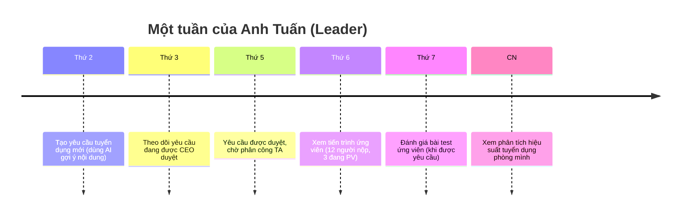
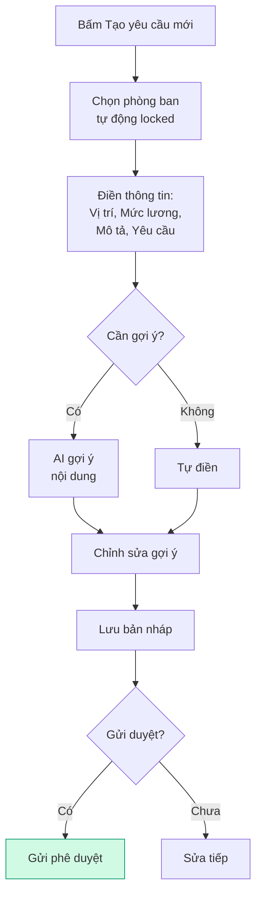

**👤 Anh Tuấn** — Trưởng phòng Kỹ thuật

> _"Mình cần người mới cho phòng, mình tạo yêu cầu, theo dõi tiến trình, và đánh giá ứng viên khi cần."_

<CardGroup cols={2}>
  <Card title="Tạo yêu cầu nhanh" icon="plus" href="#cac-buoc-tao-yeu-cau">
    6 bước từ form đến gửi duyệt
  </Card>

  <Card title="Theo dõi tiến trình" icon="chart-line" href="#theo-doi">
    Xem yêu cầu và ứng viên đang ở đâu
  </Card>

  <Card title="Đánh giá chuyên môn" icon="star" href="#danh-gia">
    Khi có ứng viên cần bạn cho điểm
  </Card>
</CardGroup>

---

## Bạn cần biết (3 điểm chính)

1. **Bạn tạo yêu cầu tuyển dụng cho phòng ban mình** — Nhập thông tin vị trí, mô tả, yêu cầu
2. **Bạn theo dõi tiến trình** — Xem yêu cầu của bạn đang ở đâu, ứng viên nào đến giai đoạn nào
3. **Bạn đánh giá chuyên môn** — Khi ứng viên làm bài test, bạn cho điểm

## Bạn KHÔNG cần biết

- ❌ Cách phân công TA (HRD lo)
- ❌ Pipeline ứng viên chi tiết (TA lo)
- ❌ Ngân sách chi tiết (HRD/BOD lo)

---

## Một tuần của bạn

---

## Quy trình tạo yêu cầu (visual) {#cac-buoc-tao-yeu-cau}

---

## 6 bước tạo yêu cầu trong V1.0

<Steps>
  <Step title="Mở màn hình tạo yêu cầu">
    Đăng nhập HRM → Bàn làm việc → **"Tạo yêu cầu mới"**
  </Step>
  <Step title="Chọn phòng ban">
    - Hệ thống tự động chọn phòng ban của bạn (không cần chọn thủ công)
    - Nếu bạn phụ trách nhiều phòng ban, chọn phòng ban cần tuyển
  </Step>
  <Step title="Điền thông tin vị trí">
    - Tên vị trí (VD: Nhân viên Marketing)
    - Số lượng cần tuyển
    - Mức lương mong muốn (tối thiểu - tối đa)
    - Địa điểm làm việc
    - Ngày cần người
    - Mô tả công việc
    - Yêu cầu ứng viên
  </Step>
  <Step title="Dùng AI gợi ý (tùy chọn)">
    - Bấm nút **"Điền bằng AI"**
    - AI sẽ gợi ý nội dung dựa trên vị trí tương tự trong công ty
    - Bạn chỉnh sửa gợi ý trước khi lưu
  </Step>
  <Step title="Lưu và gửi">
    - **"Lưu bản nháp"** — lưu để chỉnh tiếp
    - **"Gửi phê duyệt"** — chuyển cho sếp duyệt
  </Step>
  <Step title="Theo dõi">
    - Xem tiến trình ở Bàn làm việc
    - Hệ thống gửi thông báo khi có cập nhật
  </Step>
</Steps>

---

## 5 việc bạn làm thường xuyên

| Việc | Bạn làm gì | Khi nào |
| --- | --- | --- |
| 📝 **Tạo yêu cầu** | Điền form, có thể dùng AI gợi ý | Khi phòng cần người |
| 👀 **Theo dõi tiến trình** | Xem yêu cầu đang ở giai đoạn nào, ứng viên nào | Hàng ngày |
| ✍️ **Đánh giá bài test** | Xem bài làm, cho điểm, viết nhận xét | Khi có thông báo |
| 📊 **Xem phân tích** | Số yêu cầu, thời gian tuyển, hiệu suất | Cuối tháng |
| 💡 **Bổ sung KPI/OKR** | Thiết lập chỉ tiêu cho vị trí mới | Sau khi yêu cầu duyệt |

---

## Đánh giá chuyên môn ứng viên {#danh-gia}

Khi có ứng viên cần bạn đánh giá, hệ thống sẽ gửi thông báo.

<Steps>
  <Step title="Nhận thông báo">
    Hệ thống thông báo qua email và Lark khi có ứng viên cần đánh giá
  </Step>
  <Step title="Mở Bàn làm việc">
    Xem ứng viên nào đang chờ đánh giá
  </Step>
  <Step title="Xem hồ sơ ứng viên">
    Xem chi tiết kinh nghiệm, kỹ năng, lịch sử ứng tuyển (nếu có)
  </Step>
  <Step title="Đánh giá">
    - Cho điểm các tiêu chí chuyên môn
    - Ghi nhận xét về ứng viên
    - Bấm **"Đạt"** hoặc **"Chưa đạt"**
  </Step>
  <Step title="Gửi đánh giá">
    Hệ thống lưu và TA sẽ nhận được để tiếp tục xử lý
  </Step>
</Steps>

---

## Theo dõi tiến trình {#theo-doi}

Bạn có thể xem tiến trình ở **Bàn làm việc** theo 3 cấp độ:

1. **Yêu cầu của tôi** — Danh sách các yêu cầu bạn đã tạo, kèm trạng thái hiện tại
2. **Ứng viên đang xử lý** — Ứng viên nào đang ở giai đoạn nào trong pipeline
3. **Báo cáo phòng ban** — Số liệu tổng hợp về hiệu suất tuyển dụng của phòng bạn

<Tip>
  💡 **Mẹo:** Bật thông báo qua email \+ Lark để không bỏ lỡ cập nhật quan trọng.
</Tip>

---

## Tóm tắt 30 giây

> 👔 **Bạn là người "yêu cầu và theo dõi".** Khi phòng bạn cần người, bạn tạo yêu cầu. Sau đó, hệ thống giúp bạn theo dõi toàn bộ quá trình. Bạn chỉ cần can thiệp khi có ứng viên cần đánh giá chuyên môn.