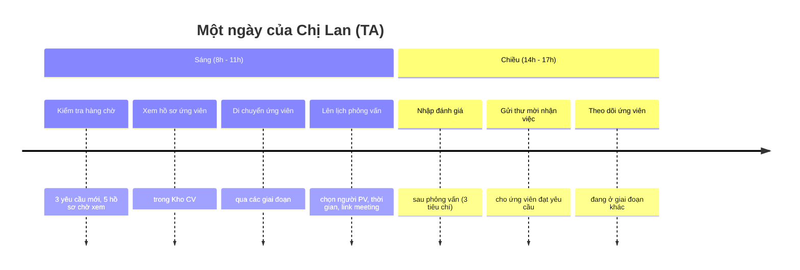
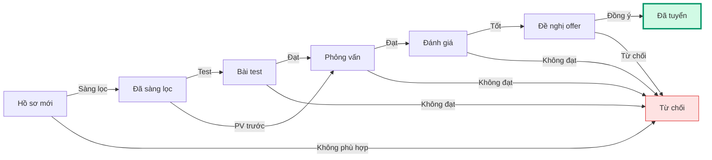

**👤 Chị Lan** — Chuyên viên Tuyển dụng

> _"Mình dành phần lớn thời gian để tìm ứng viên phù hợp và đảm bảo họ có trải nghiệm tốt với công ty."_

<CardGroup cols={2}>
  <Card title="7 bước xử lý yêu cầu" icon="list-check" href="#cac-buoc">
    Từ nhận yêu cầu đến gửi offer
  </Card>

  <Card title="Quản lý pipeline" icon="diagram-project" href="#pipeline">
    Di chuyển ứng viên qua các giai đoạn
  </Card>

  <Card title="Kho CV & Kho JD" icon="database" href="#kho">
    Tìm kiếm thông minh, clone JD có sẵn
  </Card>
</CardGroup>

---

## Bạn cần biết (3 điểm chính)

1. **Bạn xử lý các yêu cầu được phân công** — Sau khi HRD duyệt và phân công, bạn chịu trách nhiệm từ A-Z
2. **Bạn di chuyển ứng viên qua các giai đoạn** — Bằng cách kéo thẻ trong hệ thống
3. **Bạn không duyệt đơn** — Chỉ HRD, sếp phòng và Ban Giám đốc mới duyệt

## Bạn KHÔNG cần biết

- ❌ Cách hệ thống lưu trữ dữ liệu
- ❌ Các quy tắc duyệt nội bộ
- ❌ Cách phân bổ ngân sách

---

## Một ngày của bạn

---

## Quy trình xử lý ứng viên {#pipeline}

---

## 7 bước xử lý yêu cầu trong V1.0 {#cac-buoc}

<Steps>
  <Step title="Nhận yêu cầu">
    HRD phân công → bạn nhận thông báo. Yêu cầu hiển thị trong Bàn làm việc của bạn.
  </Step>
  <Step title="Tạo mô tả vị trí (JD)">
    - Vào **Kho JD** → Tạo JD mới hoặc clone JD có sẵn
    - Điền thông tin chi tiết cho vị trí
    - Xuất bản JD
  </Step>
  <Step title="Tìm ứng viên">
    - Vào **Kho CV** → Tìm kiếm hoặc upload hồ sơ mới
    - Lọc ứng viên theo tiêu chí
    - Gắn ứng viên phù hợp vào JD
  </Step>
  <Step title="Quản lý pipeline">
    - Kéo thẻ ứng viên qua các giai đoạn: Sàng lọc → Phỏng vấn → Offer
    - Mỗi lần chuyển giai đoạn, hệ thống yêu cầu ghi chú
  </Step>
  <Step title="Lên lịch phỏng vấn">
    - Khi ứng viên đến giai đoạn phỏng vấn → bấm **"Lên lịch"**
    - Chọn ngày giờ, người phỏng vấn, hình thức (online/offline)
    - Hệ thống tự gửi lịch cho ứng viên
  </Step>
  <Step title="Đánh giá sau phỏng vấn">
    - Vào **Lịch phỏng vấn** → bấm **"Nhập đánh giá"**
    - Cho điểm 3 tiêu chí: **Chuyên môn, Văn hóa, Thái độ**
    - Ghi nhận xét
  </Step>
  <Step title="Gửi offer">
    - Khi ứng viên đạt yêu cầu → kéo thẻ sang **"Đề nghị"**
    - Điền mức lương, ngày bắt đầu
    - Hệ thống tạo thư mời nhận việc
  </Step>
</Steps>

---

## Kho CV & Kho JD {#kho}

### Kho CV (CV Pool)

| Tính năng | Mô tả |
| --- | --- |
| **Upload hồ sơ** | Tải CV từ máy tính (PDF, DOC, DOCX) |
| **Tìm kiếm thông minh** | Gõ 2\+ ký tự để tìm theo tên, kỹ năng, kinh nghiệm |
| **Lọc nâng cao** | Lọc theo vị trí, kinh nghiệm, trình độ, khu vực |
| **Gắn vào JD** | Liên kết ứng viên với mô tả vị trí cụ thể |
| **Lịch sử** | Xem ứng viên này đã ứng tuyển lần nào, kết quả ra sao |

### Kho JD (JD Pool)

| Tính năng | Mô tả |
| --- | --- |
| **Tạo JD mới** | Điền form từ đầu với AI gợi ý |
| **Clone JD có sẵn** | Dùng lại JD tương tự từ thư viện (tiết kiệm 70% thời gian) |
| **Phiên bản JD** | JD có thể có nhiều phiên bản theo thời gian |
| **Liên kết yêu cầu** | JD có thể được dùng cho nhiều yêu cầu tuyển |

---

## 5 việc bạn làm thường xuyên

| Việc | Bạn làm gì | Thời gian trung bình |
| --- | --- | --- |
| 🔍 **Tìm ứng viên** | Dùng ô tìm kiếm thông minh (gõ 2\+ ký tự) trong Kho CV | 15-30 phút/ngày |
| 📅 **Lên lịch PV** | Kéo thẻ ứng viên sang giai đoạn "Phỏng vấn", điền form | 5-10 phút/lịch |
| ✍️ **Nhập đánh giá** | Sau PV, mở bảng điểm 3 phần (Chuyên môn/Văn hóa/Thái độ) | 10-15 phút/ứng viên |
| 💌 **Gửi offer** | Kéo thẻ sang "Đề nghị", điền mức lương, ngày bắt đầu | 5 phút |
| 📊 **Theo dõi tiến trình** | Xem bảng Kanban để biết ứng viên nào đang ở đâu | Liên tục |

---

## Tóm tắt 30 giây

> 🎯 **Bạn là người "chạy" yêu cầu tuyển dụng.** Sau khi HRD duyệt, bạn xử lý từ tìm ứng viên → phỏng vấn → gửi offer → tuyển thành công. Hệ thống giúp bạn theo dõi mọi ứng viên, không sợ quên ai.