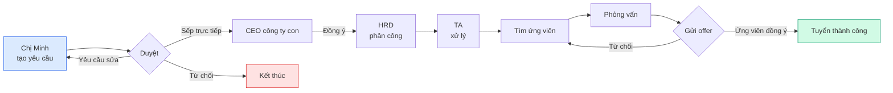
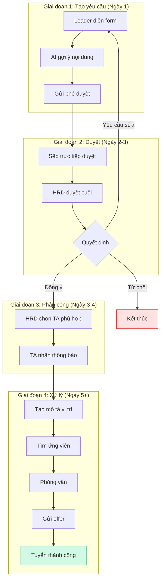
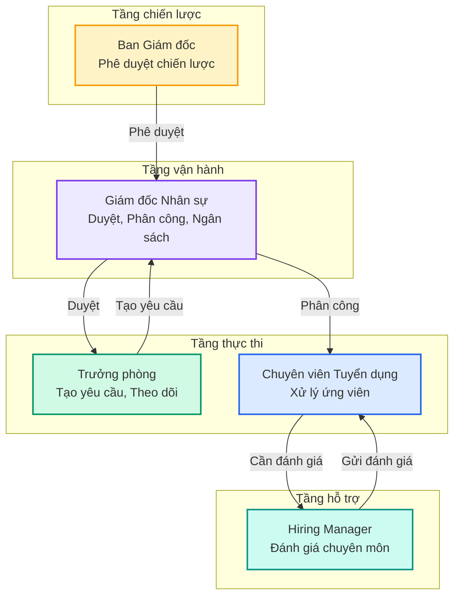

> **Phiên bản 1.0**
>
> Ngày cập nhật: 07/2026 · Đối tượng: Mọi người trong công ty · Ngôn ngữ: 100% tiếng Việt

Chào mừng bạn đến với tài liệu hướng dẫn sử dụng **HRM — Phiên bản 1.0**. Tài liệu này được thiết kế để mỗi người trong công ty — từ BOD đến Hiring Manager — đều có thể hiểu nhanh vai trò của mình và sử dụng hệ thống hiệu quả trong vòng 30 giây đầu tiên.

<CardGroup cols={2}>
  <Card title="Tổng quan nhanh" icon="bolt" href="#tong-quan-nhanh">
    5 vai trò · 6 quy trình · 30-45 ngày tuyển 1 người
  </Card>

  <Card title="Bạn là ai?" icon="user" href="#ban-la-ai">
    Chọn vai trò của bạn để đọc phần phù hợp
  </Card>

  <Card title="Hành trình yêu cầu" icon="route" href="#hanh-trinh">
    Câu chuyện của chị Minh — Leader Marketing — từ lúc tạo yêu cầu đến khi tuyển xong
  </Card>

  <Card title="5 vai trò" icon="users" href="#cac-vai-tro">
    TA · HRD · Leader · BOD · HM — mỗi vai trò một câu chuyện
  </Card>
</CardGroup>

---

## Tổng quan nhanh (30 giây đầu tiên)

HRM là hệ thống quản lý nhân sự toàn diện — nơi tập trung mọi hoạt động từ tuyển dụng, đánh giá, đến ra quyết định nhân sự.

| Con số ấn tượng |  |
| --- | --- |
| 🎯 **5 vai trò** | Mỗi vai trò có quyền hạn và công việc riêng |
| 📋 **6 quy trình chính** | Tuyển dụng, duyệt đơn, đánh giá, ngân sách, chi phí, audit |
| ⚡ **30-45 ngày** | Thời gian trung bình từ yêu cầu đến tuyển xong 1 người |
| 🔄 **Theo thời gian thực** | Mọi người đều thấy tiến trình cập nhật ngay lập tức |
| 🤖 **AI hỗ trợ** | Gợi ý nội dung yêu cầu, phân tích hồ sơ ứng viên |

---

## Bạn là ai? {#ban-la-ai}

Mỗi vai trò có một câu chuyện riêng. Bấm vào vai trò của bạn để xem chi tiết:

<CardGroup cols={2}>
  <Card title="TA — Chuyên viên Tuyển dụng" icon="magnifying-glass" href="/hrm/role-ta">
    Tìm hồ sơ, lên lịch PV, theo dõi ứng viên
  </Card>

  <Card title="HRD — Giám đốc Nhân sự" icon="building" href="/hrm/role-hrd-bod">
    Duyệt đơn, phân công TA, quản lý ngân sách
  </Card>

  <Card title="Leader — Trưởng phòng" icon="briefcase" href="/hrm/role-leader">
    Tạo yêu cầu tuyển, theo dõi tiến trình
  </Card>

  <Card title="BOD — Ban Giám đốc" icon="crown" href="/hrm/role-hrd-bod">
    Phê duyệt chiến lược, xem báo cáo tổng quan
  </Card>

  <Card title="HM — Quản lý phòng ban" icon="user-tie" href="/hrm/role-hm">
    Đánh giá chuyên môn ứng viên
  </Card>
</CardGroup>

---

## Hành trình của một yêu cầu tuyển dụng {#hanh-trinh}

Đây là câu chuyện của **chị Minh**, Trưởng phòng Marketing, khi chị muốn tuyển thêm 1 nhân viên.

### Sơ đồ quy trình

### 4 giai đoạn chính

### Tóm tắt timeline

<Note>
  💡 **Chị Minh không cần biết chi tiết kỹ thuật.** Chị chỉ cần biết:

  - Ngày 1: Chị tạo yêu cầu, gửi đi
  - Ngày 2-3: Sếp chị và HRD duyệt (chị sẽ nhận thông báo)
  - Ngày 3-4: HRD phân công cho TA (chị sẽ thấy trong bảng điều khiển)
  - Từ ngày 5: TA xử lý tuyển dụng (chị theo dõi tiến trình)
  - Khi có ứng viên cần đánh giá: chị nhận thông báo
</Note>

---

## 5 vai trò — Ai làm gì? {#cac-vai-tro}

---

## Kết luận

HRM giúp công ty:

- ⏱️ **Tiết kiệm thời gian** — Không cần hỏi qua lại, mọi thông tin đều có sẵn
- 📊 **Ra quyết định dựa trên dữ liệu** — Báo cáo trực quan, cập nhật real-time
- 🔄 **Quy trình nhất quán** — Mọi người đều đi theo cùng một quy trình
- 👁️ **Minh bạch** — Mọi người đều biết chuyện gì đang diễn ra

<Tip>
  🎉 **Cảm ơn bạn đã sử dụng HRM.** Nếu có câu hỏi, liên hệ bộ phận Hỗ trợ Nhân sự.
</Tip>