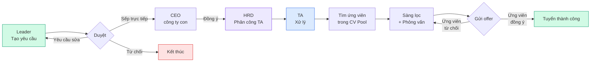
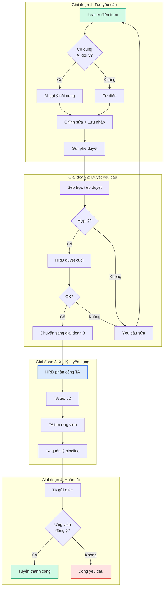

> Phần này dành cho tất cả mọi người muốn hiểu nhanh về module Tuyển dụng V1.0: mục đích, mô hình workflow, tính năng theo từng role, và câu hỏi thường gặp.

---

## 1. Giới thiệu Tuyển dụng V1.0

### V1.0 là gì?

**Tuyển dụng V1.0** là phiên bản đầu tiên của module Tuyển dụng trong hệ thống HRM. Đây là phiên bản được đưa vào sử dụng chính thức cho toàn công ty từ tháng 07/2026.

V1.0 tập trung vào **3 mục tiêu chính**:

<Steps>
  <Step title="Số hóa toàn bộ quy trình tuyển dụng">
    Thay thế email, giấy tờ, file Excel rời rạc bằng một hệ thống tập trung. Mọi người cùng xem được tiến trình, không cần hỏi qua lại.
  </Step>
  <Step title="Minh bạch quy trình duyệt">
    Mỗi yêu cầu tuyển dụng đều đi qua đúng quy trình: người tạo → người duyệt → người xử lý. Ai duyệt, khi nào duyệt, kết quả ra sao — đều ghi lại.
  </Step>
  <Step title="Theo dõi hiệu quả bằng dữ liệu">
    Ban lãnh đạo có thể nhìn thấy: phòng ban nào đang tuyển nhiều, giai đoạn nào ứng viên hay bị "rớt", ngân sách còn bao nhiêu, TA nào đang xử lý bao nhiêu yêu cầu.
  </Step>
</Steps>

### Đối tượng sử dụng V1.0

V1.0 phục vụ 4 nhóm người dùng chính (HM được tính chung với Leader trong phạm vi đánh giá):

| Nhóm | Vai trò | Mục đích sử dụng V1.0 |
| --- | --- | --- |
| **Nhóm yêu cầu** | Leader (Trưởng phòng) | Tạo yêu cầu tuyển dụng cho phòng ban |
| **Nhóm vận hành** | TA (Chuyên viên Tuyển dụng) | Xử lý yêu cầu, tìm ứng viên, theo dõi pipeline |
| **Nhóm quản lý** | HRD (Giám đốc Nhân sự) | Duyệt yêu cầu, phân công TA, quản lý ngân sách |
| **Nhóm phê duyệt** | BOD (Ban Giám đốc) | Phê duyệt chiến lược, xem báo cáo tổng quan |

<Note>
  💡 **Lưu ý:** Trong V1.0, HRD và BOD chia sẻ nhiều quyền hạn (cùng duyệt đơn, cùng xem báo cáo, cùng quản lý chi phí). Phần hướng dẫn dưới đây sẽ ghi **HRD/BOD** khi nội dung áp dụng cho cả hai.
</Note>

### Phạm vi V1.0 — Có gì và chưa có gì

**✅ V1.0 đã hỗ trợ:**

- Tạo và theo dõi yêu cầu tuyển dụng từ đầu đến cuối
- Quy trình duyệt nhiều cấp (tùy phòng ban)
- Quản lý kho hồ sơ ứng viên (CV Pool)
- Quản lý mô tả vị trí (JD Pool)
- Pipeline ứng viên với các giai đoạn rõ ràng
- Lịch phỏng vấn và đánh giá sau phỏng vấn
- Gửi thư mời nhận việc
- Quản lý ngân sách và chi phí tuyển dụng
- Báo cáo tổng quan cho ban lãnh đạo

**🚧 V1.0 chưa hỗ trợ (sẽ có ở phiên bản sau):**

- Đánh giá năng lực ứng viên bằng AI tự động
- Tích hợp trực tiếp với LinkedIn Premium Recruiter
- Hệ thống onboarding nhân viên mới
- Module đào tạo và phát triển (L&D)
- Module lương và phúc lợi (C&B)

---

## 2. Mô hình Workflow Tuyển Dụng V1.0

### Quy trình tổng quan (1 ảnh nhìn)

### Mô tả 4 giai đoạn chính

### Ai tham gia vào từng giai đoạn?

| Giai đoạn | Người thực hiện | Người liên quan | Thời gian dự kiến |
| --- | --- | --- | --- |
| **GĐ 1: Tạo yêu cầu** | Leader | — | 30 phút |
| **GĐ 2: Duyệt yêu cầu** | Sếp trực tiếp → CEO công ty con → HRD | BOD (nếu vượt cấp) | 2-3 ngày |
| **GĐ 3: Xử lý tuyển dụng** | TA (chuyên viên) | Leader (theo dõi), HM (đánh giá) | 20-30 ngày |
| **GĐ 4: Hoàn tất** | TA gửi offer, ứng viên phản hồi | HRD (quản lý chi phí) | 3-7 ngày |

**Tổng thời gian trung bình: 30-45 ngày** từ khi Leader tạo yêu cầu đến khi ứng viên bắt đầu làm việc.

---

## 3. Bảng tính năng V1.0 (theo role)

Bảng dưới đây tổng hợp **tất cả tính năng** có trong V1.0, nhóm theo 4 module chính. Tick xanh (✅) nghĩa là role đó **có quyền sử dụng** tính năng đó.

<Note>
  📌 **Chú thích ký hiệu:**

  - ✅ = Có quyền sử dụng đầy đủ
  - 🔶 = Có quyền một phần (xem nhưng không sửa, hoặc sử dụng trong phạm vi hẹp)
  - ❌ = Không có quyền sử dụng
</Note>

### Module 1: Quản lý yêu cầu tuyển dụng

| Tính năng | Leader | TA | HRD/BOD |
| --- | :-: | :-: | :-: |
| Tạo yêu cầu tuyển dụng mới | ✅ | ❌ | ✅ |
| Chỉnh sửa yêu cầu (bản nháp) | ✅ | ❌ | ✅ |
| Gửi yêu cầu phê duyệt | ✅ | ❌ | ✅ |
| Xem danh sách yêu cầu của phòng mình | ✅ | ✅ | ✅ |
| Xem tất cả yêu cầu toàn công ty | ❌ | 🔶 | ✅ |
| Duyệt yêu cầu cấp 1 (sếp trực tiếp) | 🔶 | ❌ | ✅ |
| Duyệt yêu cầu cấp 2 (CEO/HRD) | ❌ | ❌ | ✅ |
| Duyệt yêu cầu cấp 3 (BOD) | ❌ | ❌ | ✅ |
| Yêu cầu chỉnh sửa | 🔶 | ❌ | ✅ |
| Từ chối yêu cầu | 🔶 | ❌ | ✅ |
| Phân công TA cho yêu cầu | ❌ | ❌ | ✅ |
| AI gợi ý nội dung yêu cầu | ✅ | ❌ | ✅ |
| Theo dõi tiến trình yêu cầu | ✅ | ✅ | ✅ |

### Module 2: Quản lý ứng viên & phỏng vấn

| Tính năng | Leader | TA | HRD/BOD |
| --- | :-: | :-: | :-: |
| Tạo mô tả vị trí (JD) | ❌ | ✅ | ✅ |
| Chỉnh sửa JD | ❌ | ✅ | ✅ |
| Clone JD từ thư viện | ❌ | ✅ | ✅ |
| Upload hồ sơ ứng viên | ❌ | ✅ | ✅ |
| Tìm kiếm ứng viên trong kho CV | 🔶 | ✅ | ✅ |
| Xem chi tiết hồ sơ ứng viên | ✅ | ✅ | ✅ |
| Gắn ứng viên vào yêu cầu | ❌ | ✅ | ✅ |
| Di chuyển ứng viên qua các giai đoạn | ❌ | ✅ | ❌ |
| Đề xuất chuyển giai đoạn | ✅ | ❌ | ✅ |
| Lên lịch phỏng vấn | ❌ | ✅ | ✅ |
| Nhập đánh giá sau phỏng vấn | ✅ | ✅ | ✅ |
| Gửi thư mời nhận việc (offer) | ❌ | ✅ | ✅ |
| Duyệt offer (cấp cao) | ❌ | ❌ | ✅ |
| Xác nhận ứng viên đã nhận việc | ❌ | ✅ | ✅ |

### Module 3: Quản lý tổ chức & nhân sự

| Tính năng | Leader | TA | HRD/BOD |
| --- | :-: | :-: | :-: |
| Xem sơ đồ tổ chức công ty | 🔶 | ❌ | ✅ |
| Xem danh sách nhân viên | 🔶 | ❌ | ✅ |
| Xem chi tiết hồ sơ nhân viên | 🔶 | ❌ | ✅ |
| Tạo / sửa chức danh | ❌ | ❌ | ✅ |
| Quản lý từ điển năng lực | ❌ | ❌ | ✅ |
| Phân quyền người dùng | ❌ | ❌ | ✅ |
| Xem nhật ký hoạt động (audit log) | ❌ | ❌ | ✅ |

### Module 4: Báo cáo & Ngân sách

| Tính năng | Leader | TA | HRD/BOD |
| --- | :-: | :-: | :-: |
| Xem báo cáo phòng ban mình | ✅ | 🔶 | ✅ |
| Xem báo cáo tổng quan công ty | ❌ | ❌ | ✅ |
| Xem phễu tuyển dụng (funnel) | 🔶 | 🔶 | ✅ |
| Xem thời gian xử lý (SLA) | 🔶 | 🔶 | ✅ |
| So sánh hiệu suất giữa phòng ban | ❌ | ❌ | ✅ |
| Tạo kế hoạch ngân sách | ❌ | ❌ | ✅ |
| Phân bổ ngân sách cho phòng ban | ❌ | ❌ | ✅ |
| Theo dõi chi tiêu ngân sách | 🔶 | ❌ | ✅ |
| Tạo chi phí tuyển dụng | ❌ | ✅ | ✅ |
| Duyệt chi phí tuyển dụng | ❌ | ❌ | ✅ |

### Tóm tắt quyền theo role

| Role | Tổng tính năng | Có quyền đầy đủ | Một phần | Không |
| --- | --- | --- | --- | --- |
| **Leader** | ~38 | ~13 | ~12 | ~13 |
| **TA** | ~38 | ~22 | ~3 | ~13 |
| **HRD/BOD** | ~38 | ~36 | ~2 | ~0 |

<Tip>
  💡 **Nhận xét:** HRD/BOD có quyền rộng nhất (gần như toàn bộ). TA tập trung vào xử lý tuyển dụng. Leader tập trung vào tạo yêu cầu và theo dõi. Mỗi role có "vùng đất riêng" rõ ràng, không bị chồng chéo.
</Tip>