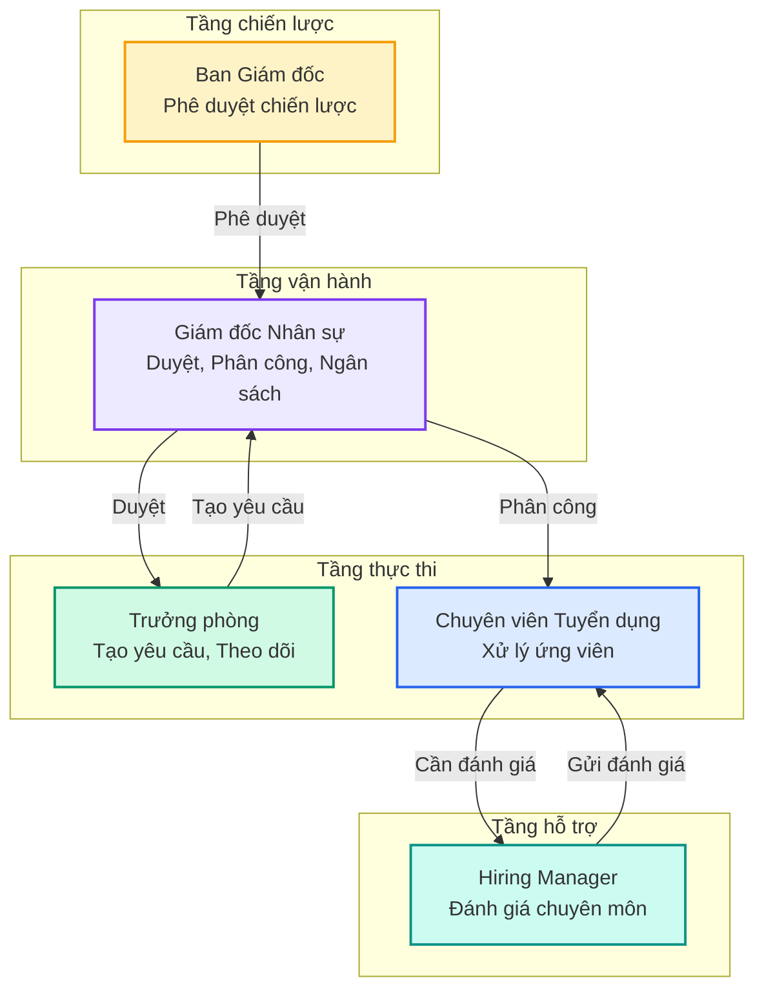

## Sơ đồ tổng quan — Ai làm gì?

---

## Kết luận

HRM giúp công ty:

- ⏱️ **Tiết kiệm thời gian** — Không cần hỏi qua lại, mọi thông tin đều có sẵn
- 📊 **Ra quyết định dựa trên dữ liệu** — Báo cáo trực quan, cập nhật real-time
- 🔄 **Quy trình nhất quán** — Mọi người đều đi theo cùng một quy trình
- 👁️ **Minh bạch** — Mọi người đều biết chuyện gì đang diễn ra

<Tip>
  🎉 **Cảm ơn bạn đã sử dụng HRM.** Nếu có câu hỏi, liên hệ bộ phận Hỗ trợ Nhân sự.
</Tip>