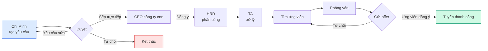
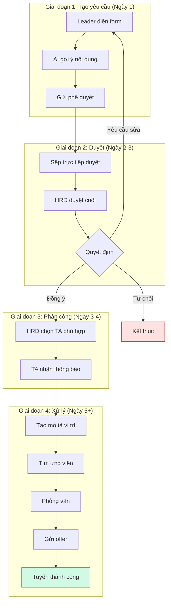

## Tổng quan nhanh (30 giây đầu tiên)

HRM là hệ thống quản lý nhân sự toàn diện — nơi tập trung mọi hoạt động từ tuyển dụng, đánh giá, đến ra quyết định nhân sự.

| Con số ấn tượng |  |
| --- | --- |
| 🎯 **5 vai trò** | Mỗi vai trò có quyền hạn và công việc riêng |
| 📋 **6 quy trình chính** | Tuyển dụng, duyệt đơn, đánh giá, ngân sách, chi phí, audit |
| ⚡ **30-45 ngày** | Thời gian trung bình từ yêu cầu đến tuyển xong 1 người |
| 🔄 **Theo thời gian thực** | Mọi người đều thấy tiến trình cập nhật ngay lập tức |
| 🤖 **AI hỗ trợ** | Gợi ý nội dung yêu cầu, phân tích hồ sơ ứng viên |

## Bạn là ai? (Chọn vai trò của bạn)

Mỗi vai trò có một câu chuyện riêng. Chọn vai trò của bạn để xem hướng dẫn chi tiết:

<CardGroup cols={2}>
  <Card title="🎯 TA — Chuyên viên Tuyển dụng" href="/huong-dan-hrm/vai-tro-ta">
    Tìm hồ sơ, lên lịch phỏng vấn, theo dõi ứng viên
  </Card>

  <Card title="🏢 HRD — Giám đốc Nhân sự" href="/huong-dan-hrm/vai-tro-hrd">
    Duyệt đơn, phân công TA, quản lý ngân sách
  </Card>

  <Card title="👔 Leader — Trưởng phòng" href="/huong-dan-hrm/vai-tro-leader">
    Tạo yêu cầu tuyển, theo dõi tiến trình
  </Card>

  <Card title="🎩 BOD — Ban Giám đốc" href="/huong-dan-hrm/vai-tro-bod">
    Phê duyệt chiến lược, xem báo cáo tổng quan
  </Card>

  <Card title="🧑‍💼 HM — Quản lý phòng ban" href="/huong-dan-hrm/vai-tro-hm">
    Đánh giá chuyên môn ứng viên
  </Card>
</CardGroup>

## Hành trình của một yêu cầu tuyển dụng

Đây là câu chuyện của **chị Minh**, Trưởng phòng Marketing, khi chị muốn tuyển thêm 1 nhân viên.

### Sơ đồ quy trình

### 4 giai đoạn chính

<Tip>
  **Chị Minh không cần biết chi tiết kỹ thuật.** Chị chỉ cần biết:

  - Ngày 1: Chị tạo yêu cầu, gửi đi
  - Ngày 2-3: Sếp chị và HRD duyệt (chị sẽ nhận thông báo)
  - Ngày 3-4: HRD phân công cho TA (chị sẽ thấy trong bảng điều khiển)
  - Từ ngày 5: TA xử lý tuyển dụng (chị theo dõi tiến trình)
  - Khi có ứng viên cần đánh giá: chị nhận thông báo
</Tip>