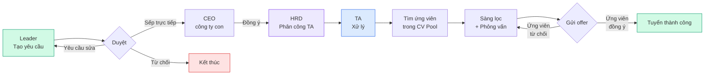
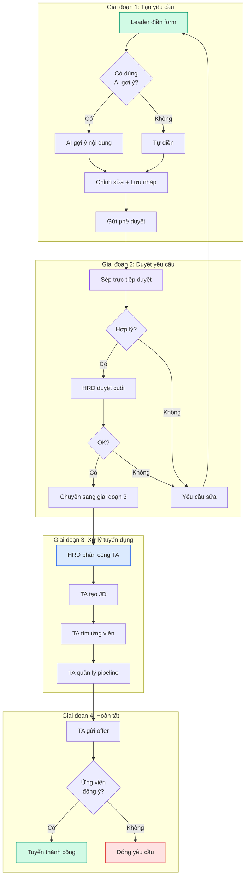

<Note>
  Phần này dành cho tất cả mọi người muốn hiểu nhanh về module Tuyển dụng V1.0: mục đích, mô hình workflow, tính năng theo từng role, và câu hỏi thường gặp.
</Note>

## 1. Giới thiệu Tuyển dụng V1.0

### V1.0 là gì?

**Tuyển dụng V1.0** là phiên bản đầu tiên của module Tuyển dụng trong hệ thống HRM. Đây là phiên bản được đưa vào sử dụng chính thức cho toàn công ty từ tháng 07/2026.

V1.0 tập trung vào **3 mục tiêu chính**:

<Steps>
  <Step title="Số hóa toàn bộ quy trình tuyển dụng">
    Thay thế email, giấy tờ, file Excel rời rạc bằng một hệ thống tập trung. Mọi người cùng xem được tiến trình, không cần hỏi qua lại.
  </Step>
  <Step title="Minh bạch quy trình duyệt">
    Mỗi yêu cầu tuyển dụng đều đi qua đúng quy trình: người tạo → người duyệt → người xử lý. Ai duyệt, khi nào duyệt, kết quả ra sao — đều ghi lại.
  </Step>
  <Step title="Theo dõi hiệu quả bằng dữ liệu">
    Ban lãnh đạo có thể nhìn thấy: phòng ban nào đang tuyển nhiều, giai đoạn nào ứng viên hay bị "rớt", ngân sách còn bao nhiêu, TA nào đang xử lý bao nhiêu yêu cầu.
  </Step>
</Steps>

### Đối tượng sử dụng V1.0

V1.0 phục vụ 4 nhóm người dùng chính (HM được tính chung với Leader trong phạm vi đánh giá):

| Nhóm | Vai trò | Mục đích sử dụng V1.0 |
| --- | --- | --- |
| **Nhóm yêu cầu** | Leader (Trưởng phòng) | Tạo yêu cầu tuyển dụng cho phòng ban |
| **Nhóm vận hành** | TA (Chuyên viên Tuyển dụng) | Xử lý yêu cầu, tìm ứng viên, theo dõi pipeline |
| **Nhóm quản lý** | HRD (Giám đốc Nhân sự) | Duyệt yêu cầu, phân công TA, quản lý ngân sách |
| **Nhóm phê duyệt** | BOD (Ban Giám đốc) | Phê duyệt chiến lược, xem báo cáo tổng quan |

<Note>
  Trong V1.0, HRD và BOD chia sẻ nhiều quyền hạn (cùng duyệt đơn, cùng xem báo cáo, cùng quản lý chi phí). Phần hướng dẫn dưới đây sẽ ghi **HRD/BOD** khi nội dung áp dụng cho cả hai.
</Note>

### Phạm vi V1.0 — Có gì và chưa có gì

<CardGroup cols={2}>
  <Card title="✅ V1.0 đã hỗ trợ" icon="circle-check">
    - Tạo và theo dõi yêu cầu tuyển dụng từ đầu đến cuối
    - Quy trình duyệt nhiều cấp (tùy phòng ban)
    - Quản lý kho hồ sơ ứng viên (CV Pool)
    - Quản lý mô tả vị trí (JD Pool)
    - Pipeline ứng viên với các giai đoạn rõ ràng
    - Lịch phỏng vấn và đánh giá sau phỏng vấn
    - Gửi thư mời nhận việc
    - Quản lý ngân sách và chi phí tuyển dụng
    - Báo cáo tổng quan cho ban lãnh đạo
  </Card>

  <Card title="🚧 V1.0 chưa hỗ trợ (sẽ có ở phiên bản sau)" icon="hammer">
    - Đánh giá năng lực ứng viên bằng AI tự động
    - Tích hợp trực tiếp với LinkedIn Premium Recruiter
    - Hệ thống onboarding nhân viên mới
    - Module đào tạo và phát triển (L&D)
    - Module lương và phúc lợi (C&B)
  </Card>
</CardGroup>

---

## 2. Mô hình Workflow Tuyển Dụng V1.0

### Quy trình tổng quan

### Mô tả 4 giai đoạn chính

### Ai tham gia vào từng giai đoạn?

| Giai đoạn | Người thực hiện | Người liên quan | Thời gian dự kiến |
| --- | --- | --- | --- |
| **GĐ 1: Tạo yêu cầu** | Leader | — | 30 phút |
| **GĐ 2: Duyệt yêu cầu** | Sếp trực tiếp → CEO công ty con → HRD | BOD (nếu vượt cấp) | 2-3 ngày |
| **GĐ 3: Xử lý tuyển dụng** | TA (chuyên viên) | Leader (theo dõi), HM (đánh giá) | 20-30 ngày |
| **GĐ 4: Hoàn tất** | TA gửi offer, ứng viên phản hồi | HRD (quản lý chi phí) | 3-7 ngày |

**Tổng thời gian trung bình: 30-45 ngày** từ khi Leader tạo yêu cầu đến khi ứng viên bắt đầu làm việc.

---

## 3. Bảng tính năng V1.0 (theo role)

Bảng dưới đây tổng hợp **tất cả tính năng** có trong V1.0, nhóm theo 4 module chính. Tick xanh (✅) nghĩa là role đó **có quyền sử dụng** tính năng đó.

<Note>
  **Chú thích ký hiệu:** ✅ = Có quyền sử dụng đầy đủ · 🔶 = Có quyền một phần (xem nhưng không sửa, hoặc sử dụng trong phạm vi hẹp) · ❌ = Không có quyền sử dụng
</Note>

### Module 1: Quản lý yêu cầu tuyển dụng

| Tính năng | Leader | TA | HRD/BOD |
| --- | :-: | :-: | :-: |
| Tạo yêu cầu tuyển dụng mới | ✅ | ❌ | ✅ |
| Chỉnh sửa yêu cầu (bản nháp) | ✅ | ❌ | ✅ |
| Gửi yêu cầu phê duyệt | ✅ | ❌ | ✅ |
| Xem danh sách yêu cầu của phòng mình | ✅ | ✅ | ✅ |
| Xem tất cả yêu cầu toàn công ty | ❌ | 🔶 | ✅ |
| Duyệt yêu cầu cấp 1 (sếp trực tiếp) | 🔶 | ❌ | ✅ |
| Duyệt yêu cầu cấp 2 (CEO/HRD) | ❌ | ❌ | ✅ |
| Duyệt yêu cầu cấp 3 (BOD) | ❌ | ❌ | ✅ |
| Yêu cầu chỉnh sửa | 🔶 | ❌ | ✅ |
| Từ chối yêu cầu | 🔶 | ❌ | ✅ |
| Phân công TA cho yêu cầu | ❌ | ❌ | ✅ |
| AI gợi ý nội dung yêu cầu | ✅ | ❌ | ✅ |
| Theo dõi tiến trình yêu cầu | ✅ | ✅ | ✅ |

### Module 2: Quản lý ứng viên & phỏng vấn

| Tính năng | Leader | TA | HRD/BOD |
| --- | :-: | :-: | :-: |
| Tạo mô tả vị trí (JD) | ❌ | ✅ | ✅ |
| Chỉnh sửa JD | ❌ | ✅ | ✅ |
| Clone JD từ thư viện | ❌ | ✅ | ✅ |
| Upload hồ sơ ứng viên | ❌ | ✅ | ✅ |
| Tìm kiếm ứng viên trong kho CV | 🔶 | ✅ | ✅ |
| Xem chi tiết hồ sơ ứng viên | ✅ | ✅ | ✅ |
| Gắn ứng viên vào yêu cầu | ❌ | ✅ | ✅ |
| Di chuyển ứng viên qua các giai đoạn | ❌ | ✅ | ❌ |
| Đề xuất chuyển giai đoạn | ✅ | ❌ | ✅ |
| Lên lịch phỏng vấn | ❌ | ✅ | ✅ |
| Nhập đánh giá sau phỏng vấn | ✅ | ✅ | ✅ |
| Gửi thư mời nhận việc (offer) | ❌ | ✅ | ✅ |
| Duyệt offer (cấp cao) | ❌ | ❌ | ✅ |
| Xác nhận ứng viên đã nhận việc | ❌ | ✅ | ✅ |

### Module 3: Quản lý tổ chức & nhân sự

| Tính năng | Leader | TA | HRD/BOD |
| --- | :-: | :-: | :-: |
| Xem sơ đồ tổ chức công ty | 🔶 | ❌ | ✅ |
| Xem danh sách nhân viên | 🔶 | ❌ | ✅ |
| Xem chi tiết hồ sơ nhân viên | 🔶 | ❌ | ✅ |
| Tạo / sửa chức danh | ❌ | ❌ | ✅ |
| Quản lý từ điển năng lực | ❌ | ❌ | ✅ |
| Phân quyền người dùng | ❌ | ❌ | ✅ |
| Xem nhật ký hoạt động (audit log) | ❌ | ❌ | ✅ |

### Module 4: Báo cáo & Ngân sách

| Tính năng | Leader | TA | HRD/BOD |
| --- | :-: | :-: | :-: |
| Xem báo cáo phòng ban mình | ✅ | 🔶 | ✅ |
| Xem báo cáo tổng quan công ty | ❌ | ❌ | ✅ |
| Xem phễu tuyển dụng (funnel) | 🔶 | 🔶 | ✅ |
| Xem thời gian xử lý (SLA) | 🔶 | 🔶 | ✅ |
| So sánh hiệu suất giữa phòng ban | ❌ | ❌ | ✅ |
| Tạo kế hoạch ngân sách | ❌ | ❌ | ✅ |
| Phân bổ ngân sách cho phòng ban | ❌ | ❌ | ✅ |
| Theo dõi chi tiêu ngân sách | 🔶 | ❌ | ✅ |
| Tạo chi phí tuyển dụng | ❌ | ✅ | ✅ |
| Duyệt chi phí tuyển dụng | ❌ | ❌ | ✅ |

### Tóm tắt quyền theo role

| Role | Tổng tính năng | Có quyền đầy đủ | Một phần | Không |
| --- | --- | --- | --- | --- |
| **Leader** | ~38 | ~13 | ~12 | ~13 |
| **TA** | ~38 | ~22 | ~3 | ~13 |
| **HRD/BOD** | ~38 | ~36 | ~2 | ~0 |

<Tip>
  HRD/BOD có quyền rộng nhất (gần như toàn bộ). TA tập trung vào xử lý tuyển dụng. Leader tập trung vào tạo yêu cầu và theo dõi. Mỗi role có "vùng đất riêng" rõ ràng, không bị chồng chéo.
</Tip>

---

## 4. Hướng dẫn sử dụng V1.0 theo Role

Phần này bổ sung cho hướng dẫn theo vai trò ở các trang trước. ở đây tập trung vào **các bước cụ thể trong V1.0** cho mỗi role.

### 4.1 Leader — Các bước tạo yêu cầu trong V1.0

<Steps>
  <Step title="Mở màn hình tạo yêu cầu">
    Đăng nhập HRM → Bàn làm việc → "Tạo yêu cầu mới"
  </Step>
  <Step title="Chọn phòng ban">
    Hệ thống tự động chọn phòng ban của bạn (không cần chọn thủ công). Nếu bạn phụ trách nhiều phòng ban, chọn phòng ban cần tuyển.
  </Step>
  <Step title="Điền thông tin vị trí">
    Tên vị trí (VD: Nhân viên Marketing), số lượng cần tuyển, mức lương mong muốn (tối thiểu - tối đa), địa điểm làm việc, ngày cần người, mô tả công việc, yêu cầu ứng viên.
  </Step>
  <Step title="Dùng AI gợi ý (tùy chọn)">
    Bấm nút "Điền bằng AI" — AI sẽ gợi ý nội dung dựa trên vị trí tương tự trong công ty. Bạn chỉnh sửa gợi ý trước khi lưu.
  </Step>
  <Step title="Lưu và gửi">
    "Lưu bản nháp" — lưu để chỉnh tiếp. "Gửi phê duyệt" — chuyển cho sếp duyệt.
  </Step>
  <Step title="Theo dõi">
    Xem tiến trình ở Bàn làm việc. Hệ thống gửi thông báo khi có cập nhật.
  </Step>
</Steps>

### 4.2 TA — Các bước xử lý yêu cầu trong V1.0

<Steps>
  <Step title="Nhận yêu cầu">
    HRD phân công → bạn nhận thông báo. Yêu cầu hiển thị trong Bàn làm việc của bạn.
  </Step>
  <Step title="Tạo mô tả vị trí (JD)">
    Vào Kho JD → Tạo JD mới hoặc clone JD có sẵn → điền thông tin chi tiết cho vị trí → xuất bản JD.
  </Step>
  <Step title="Tìm ứng viên">
    Vào Kho CV → tìm kiếm hoặc upload hồ sơ mới → lọc ứng viên theo tiêu chí → gắn ứng viên phù hợp vào JD.
  </Step>
  <Step title="Quản lý pipeline">
    Kéo thẻ ứng viên qua các giai đoạn: Sàng lọc → Phỏng vấn → Offer. Mỗi lần chuyển giai đoạn, hệ thống yêu cầu ghi chú.
  </Step>
  <Step title="Lên lịch phỏng vấn">
    Khi ứng viên đến giai đoạn phỏng vấn → bấm "Lên lịch" → chọn ngày giờ, người phỏng vấn, hình thức (online/offline). Hệ thống tự gửi lịch cho ứng viên.
  </Step>
  <Step title="Đánh giá sau phỏng vấn">
    Vào Lịch phỏng vấn → bấm "Nhập đánh giá" → cho điểm 3 tiêu chí: Chuyên môn, Văn hóa, Thái độ → ghi nhận xét.
  </Step>
  <Step title="Gửi offer">
    Khi ứng viên đạt yêu cầu → kéo thẻ sang "Đề nghị" → điền mức lương, ngày bắt đầu. Hệ thống tạo thư mời nhận việc.
  </Step>
</Steps>

### 4.3 HRD/BOD — Các bước duyệt và quản lý trong V1.0

<Steps>
  <Step title="Mở hàng chờ duyệt">
    Bàn làm việc → Hàng chờ duyệt, hoặc vào thẳng menu "Duyệt yêu cầu".
  </Step>
  <Step title="Xem chi tiết yêu cầu">
    Bấm vào yêu cầu để xem thông tin đầy đủ. Kiểm tra: phòng ban, vị trí, mức lương, lý do cần tuyển, người đề xuất.
  </Step>
  <Step title="Quyết định">
    **Duyệt** — yêu cầu tiếp tục, chuyển sang giai đoạn tiếp. **Yêu cầu chỉnh sửa** — gửi lại Leader để sửa. **Từ chối** — kết thúc yêu cầu (kèm lý do).
  </Step>
  <Step title="Phân công TA (sau khi duyệt)">
    Bấm "Phân công TA" → chọn TA phù hợp từ danh sách → TA nhận thông báo.
  </Step>
  <Step title="Theo dõi tiến trình">
    Xem báo cáo tổng quan, kiểm tra hiệu suất các TA, cảnh báo nếu yêu cầu bị chậm.
  </Step>
  <Step title="Quản lý ngân sách và chi phí">
    Vào "Ngân sách" → xem tổng quan ngân sách năm/quý. Vào "Chi phí" → duyệt các khoản chi phí tuyển dụng.
  </Step>
</Steps>

### 4.4 HM — Các bước đánh giá ứng viên trong V1.0

<Steps>
  <Step title="Nhận thông báo">
    Khi có ứng viên cần bạn đánh giá, hệ thống gửi thông báo.
  </Step>
  <Step title="Mở Bàn làm việc">
    Xem ứng viên nào đang chờ đánh giá.
  </Step>
  <Step title="Xem hồ sơ ứng viên">
    Xem chi tiết kinh nghiệm, kỹ năng, lịch sử ứng tuyển (nếu có).
  </Step>
  <Step title="Đánh giá">
    Cho điểm các tiêu chí chuyên môn, ghi nhận xét về ứng viên, bấm "Đạt" hoặc "Chưa đạt".
  </Step>
  <Step title="Gửi đánh giá">
    Hệ thống lưu và TA sẽ nhận được để tiếp tục xử lý.
  </Step>
</Steps>

---

## 5. FAQ — Câu hỏi thường gặp khi dùng V1.0

<AccordionGroup>
  <Accordion title="V1.0 khác gì so với phiên bản trước (nếu có)?">
    V1.0 là phiên bản đầu tiên được đưa vào sử dụng chính thức. Trước đó, quy trình tuyển dụng được xử lý qua email, file Excel, Base và Lark — không có hệ thống tập trung. V1.0 thay thế tất cả bằng một hệ thống duy nhất.
  </Accordion>

  <Accordion title="Khi nào V2.0 ra mắt?">
    Chưa có lịch chính thức cho V2.0. V2.0 sẽ bổ sung các tính năng chưa có ở V1.0: đánh giá năng lực bằng AI, tích hợp LinkedIn Premium, module onboarding, L&D, C&B.
  </Accordion>

  <Accordion title="Tôi có thể dùng V1.0 trên điện thoại không?">
    Có. V1.0 có phiên bản web responsive, hoạt động trên cả máy tính và điện thoại. Hiện tại chưa có ứng dụng mobile riêng.
  </Accordion>

  <Accordion title="Tôi có thể tạo yêu cầu tuyển cho phòng ban khác không?">
    Không. Bạn chỉ tạo yêu cầu cho phòng ban mà bạn phụ trách. Nếu cần tuyển cho phòng ban khác, liên hệ Leader phòng ban đó.
  </Accordion>

  <Accordion title="Yêu cầu của tôi bị 'treo' lâu, không thấy tiến trình gì, phải làm sao?">
    Có 3 bước kiểm tra: (1) Vào Bàn làm việc → xem yêu cầu đang ở trạng thái nào; (2) Nếu đang chờ duyệt → nhắc nhở người duyệt; (3) Nếu đã duyệt nhưng chưa có TA → liên hệ HRD để phân công lại. Nếu vẫn không rõ, liên hệ bộ phận Hỗ trợ Nhân sự.
  </Accordion>

  <Accordion title="Ứng viên từ chối offer, tôi phải làm gì?">
    **TA**: ghi nhận vào hệ thống, đóng yêu cầu hoặc tìm ứng viên khác. **Leader**: đợi TA cập nhật, có thể đề xuất điều chỉnh mức lương nếu cần. **HRD/BOD**: xem báo cáo để đánh giá nguyên nhân (lương thấp, văn hóa không phù hợp...).
  </Accordion>

  <Accordion title="Tôi có thể chỉnh sửa yêu cầu sau khi đã gửi duyệt không?">
    Không thể chỉnh sửa trực tiếp. Nếu người duyệt yêu cầu chỉnh sửa → bạn nhận thông báo → chỉnh sửa và gửi lại. Nếu bạn muốn chỉnh sửa → hủy yêu cầu cũ, tạo yêu cầu mới.
  </Accordion>

  <Accordion title="Hệ thống có hỗ trợ tiếng Anh không?">
    Hiện tại V1.0 chỉ hỗ trợ tiếng Việt. Giao diện, thông báo, và hướng dẫn đều bằng tiếng Việt. Hỗ trợ đa ngôn ngữ sẽ có ở phiên bản sau.
  </Accordion>

  <Accordion title="Làm sao để xem lịch sử hoạt động của một yêu cầu?">
    Vào chi tiết yêu cầu → tab "Lịch sử" (nếu có), hoặc liên hệ HRD để xem nhật ký kiểm tra (audit log) - chỉ HRD/BOD mới có quyền này.
  </Accordion>

  <Accordion title="Tôi có thể xuất dữ liệu ra Excel không?">
    Hiện tại V1.0 chưa hỗ trợ xuất Excel. Tính năng này đang được phát triển cho phiên bản tiếp theo. Trong thời gian chờ, nếu cần dữ liệu, liên hệ HRD.
  </Accordion>

  <Accordion title="Hệ thống có thông báo qua email không?">
    Có. V1.0 gửi email thông báo khi: có yêu cầu mới cần bạn duyệt; yêu cầu của bạn được duyệt/từ chối/yêu cầu chỉnh sửa; ứng viên chuyển giai đoạn quan trọng; có chi phí mới cần duyệt. Bạn có thể tắt một số thông báo trong phần Cài đặt cá nhân (nếu có).
  </Accordion>

  <Accordion title="Nếu tôi gặp lỗi kỹ thuật, liên hệ ai?">
    Liên hệ bộ phận Hỗ trợ Nhân sự hoặc gửi email đến địa chỉ hỗ trợ được ghi trên trang đăng nhập. Khi báo lỗi, vui lòng cung cấp: mô tả lỗi (đang làm gì thì bị lỗi), ảnh chụp màn hình (nếu có), thời gian xảy ra lỗi.
  </Accordion>
</AccordionGroup>

---

## 6. Phụ lục V1.0 — Glossary & Liên hệ hỗ trợ

### Thuật ngữ V1.0 (bổ sung)

| Thuật ngữ | Nghĩa |
| --- | --- |
| **V1.0** | Phiên bản đầu tiên của module Tuyển dụng |
| **Pipeline** | Quy trình ứng viên qua các giai đoạn (sàng lọc → PV → offer → tuyển) |
| **JD Pool** | Kho mô tả vị trí, dùng để clone cho yêu cầu mới |
| **CV Pool** | Kho hồ sơ ứng viên, dùng để tìm kiếm và gắn vào JD |
| **Phân công TA** | HRD chỉ định TA xử lý một yêu cầu cụ thể |
| **Offer** | Thư mời nhận việc gửi cho ứng viên đạt yêu cầu |
| **SLA** | Thời gian xử lý tối đa cho mỗi giai đoạn |
| **Funnel** | Phễu tuyển dụng — số ứng viên giảm dần qua các giai đoạn |

### Liên hệ hỗ trợ

Khi gặp vấn đề khi sử dụng V1.0:

- **Lark**: Nhắn tin cho HRD hoặc tạo ticket trong group HRM Support