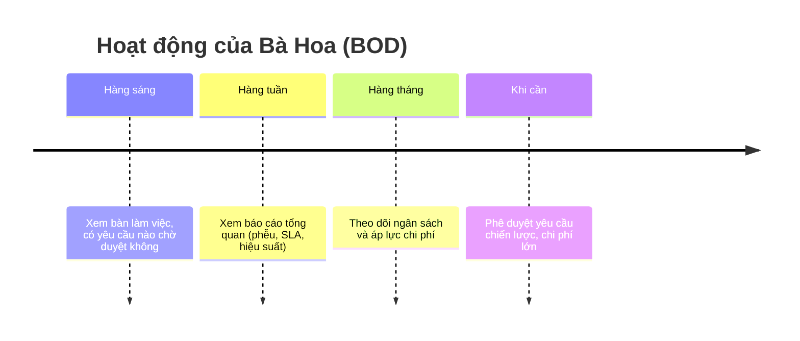
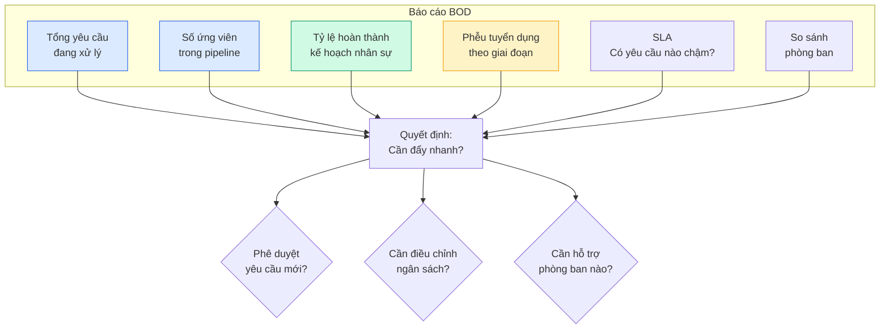

<Card>
  **👤 Bà Hoa** — Phó Tổng Giám đốc

  _"Mình cần nhìn tổng quan và ra quyết định chiến lược — không cần biết chi tiết từng ứng viên."_
</Card>

## Bạn cần biết (3 điểm chính)

1. **Bạn phê duyệt yêu cầu chiến lược** — Các yêu cầu lớn, vị trí cấp cao, mức lương cao
2. **Bạn xem báo cáo tổng quan** — Phễu tuyển dụng, ngân sách, hiệu suất toàn công ty
3. **Bạn phê duyệt chi phí lớn** — Headhunter, sự kiện tuyển dụng lớn

<Note>
  **Bạn KHÔNG cần biết:** chi tiết từng ứng viên (TA và HRD xử lý), cách hệ thống vận hành, cấu hình chi tiết.
</Note>

## Hoạt động của bạn

### Báo cáo tổng quan bạn thấy

### 4 việc bạn làm thường xuyên

| Việc | Bạn làm gì | Tần suất |
| --- | --- | --- |
| ✅ **Phê duyệt chiến lược** | Xem chi tiết yêu cầu lớn, quyết định | Khi có thông báo |
| 📊 **Xem báo cáo tổng quan** | Phễu, SLA, hiệu suất | Hàng tuần |
| 💰 **Theo dõi ngân sách** | Áp lực chi tiêu, cảnh báo | Hàng tháng |
| 💼 **Phê duyệt chi phí lớn** | Headhunter, sự kiện tuyển dụng | Khi cần |

<Tip>
  🎩 **Bạn là người "nhìn tổng quan và ra quyết định lớn".** Bạn không cần biết chi tiết từng ứng viên, nhưng bạn cần biết công ty đang tuyển được bao nhiêu, chi tiêu bao nhiêu, có vấn đề gì cần can thiệp không.
</Tip>