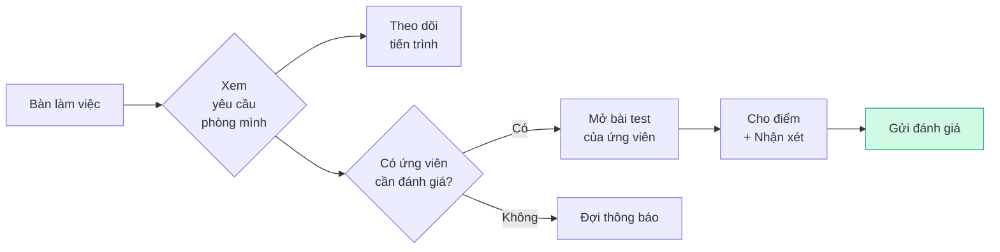

<Card>
  **👤 Chị Mai** — Trưởng phòng Kinh doanh

  _"Mình không tạo yêu cầu tuyển, nhưng mình tham gia đánh giá ứng viên khi được yêu cầu."_
</Card>

## Bạn cần biết (3 điểm chính)

1. **Bạn tham gia đánh giá ứng viên** — Khi TA hoặc HRD cần đánh giá chuyên môn từ bạn
2. **Bạn xem yêu cầu của phòng mình** — Theo dõi tiến trình qua Bàn làm việc
3. **Bạn có quyền hạn chế** — Chỉ một số chức năng, không phải tất cả

<Warning>
  **Lưu ý:** Giao diện HRM đang được tối ưu cho TA và Leader. HM hiện tại chỉ sử dụng Bàn làm việc và chức năng đánh giá. Các tính năng chi tiết hơn đang được phát triển.
</Warning>

## Hoạt động của bạn

<Tip>
  🧑‍💼 **Bạn là người "tham gia đánh giá".** Bạn không tạo yêu cầu, không xử lý tuyển, nhưng khi ứng viên cần đánh giá chuyên môn, bạn sẽ nhận thông báo và đánh giá qua HRM.
</Tip>