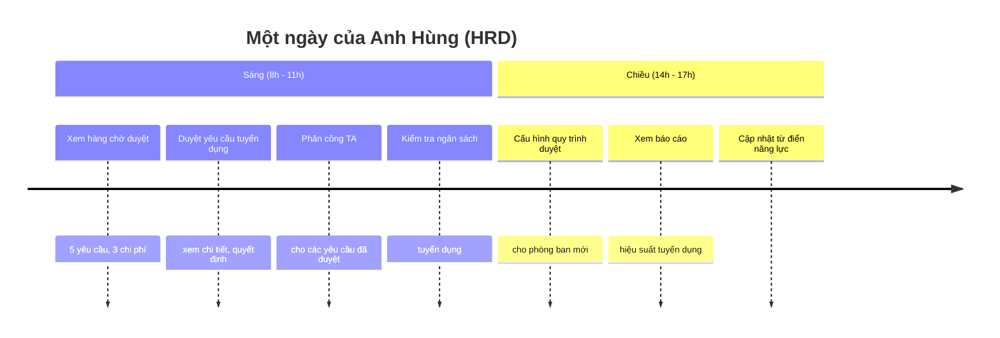
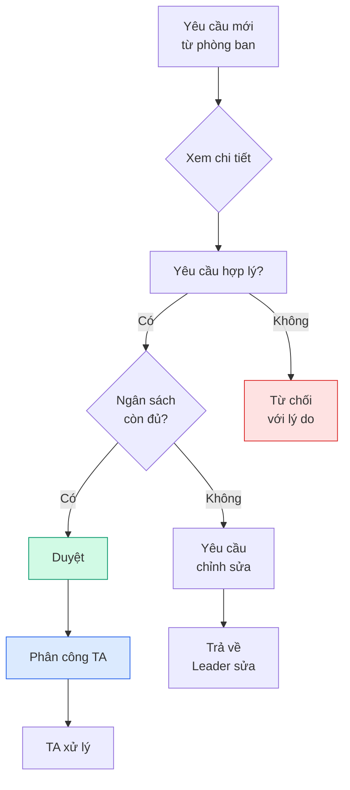

<Card>
  **👤 Anh Hùng** — Giám đốc Nhân sự

  _"Mình đảm bảo mọi quy trình nhân sự chạy đúng và mọi người đều có thông tin cần thiết."_
</Card>

## Bạn cần biết (3 điểm chính)

1. **Bạn duyệt tất cả yêu cầu tuyển dụng** — Là người duyệt cuối cùng trước khi phân công TA
2. **Bạn phân công TA** — Chọn chuyên viên phù hợp cho từng yêu cầu
3. **Bạn quản lý ngân sách** — Theo dõi chi phí tuyển dụng, cảnh báo khi sắp vượt

<Note>
  **Bạn KHÔNG cần biết:** chi tiết pipeline ứng viên (TA xử lý), cách AI đánh giá hồ sơ, cấu hình database.
</Note>

## Một ngày của bạn

### Quy trình duyệt

### 6 việc bạn làm thường xuyên

| Việc | Bạn làm gì | Tần suất |
| --- | --- | --- |
| ✅ **Duyệt yêu cầu** | Xem chi tiết, quyết định Duyệt/Sửa/Từ chối | Hàng ngày |
| 👥 **Phân công TA** | Chọn TA phù hợp dựa trên phòng ban, workload | Hàng ngày |
| 💰 **Quản lý ngân sách** | Theo dõi chi tiêu, cảnh báo vượt ngân sách | Hàng tuần |
| ⚙️ **Cấu hình quy trình** | Thiết lập luồng duyệt cho phòng ban mới | Khi cần |
| 📊 **Xem báo cáo** | Phễu tuyển dụng, SLA, hiệu suất TA | Hàng tuần |
| 📚 **Quản lý từ điển năng lực** | Cập nhật danh sách năng lực công ty | Hàng tháng |

<Tip>
  🏢 **Bạn là người "vận hành hệ thống".** Bạn duyệt đơn, phân công người, quản lý tiền, cấu hình quy trình. Mục tiêu của bạn là đảm bảo mọi thứ chạy trơn tru và đúng quy trình.
</Tip>