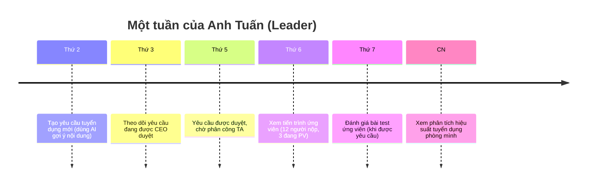
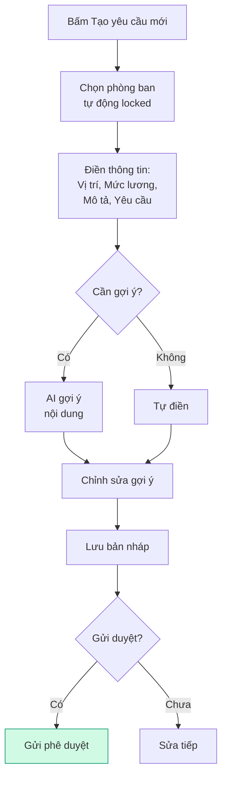

<Card>
  **👤 Anh Tuấn** — Trưởng phòng Kỹ thuật

  _"Mình cần người mới cho phòng, mình tạo yêu cầu, theo dõi tiến trình, và đánh giá ứng viên khi cần."_
</Card>

## Bạn cần biết (3 điểm chính)

1. **Bạn tạo yêu cầu tuyển dụng cho phòng ban mình** — Nhập thông tin vị trí, mô tả, yêu cầu
2. **Bạn theo dõi tiến trình** — Xem yêu cầu của bạn đang ở đâu, ứng viên nào đến giai đoạn nào
3. **Bạn đánh giá chuyên môn** — Khi ứng viên làm bài test, bạn cho điểm

<Note>
  **Bạn KHÔNG cần biết:** cách phân công TA (HRD lo), pipeline ứng viên chi tiết (TA lo), ngân sách chi tiết (HRD/BOD lo).
</Note>

## Một tuần của bạn

### Quy trình tạo yêu cầu

### 5 việc bạn làm thường xuyên

| Việc | Bạn làm gì | Khi nào |
| --- | --- | --- |
| 📝 **Tạo yêu cầu** | Điền form, có thể dùng AI gợi ý | Khi phòng cần người |
| 👀 **Theo dõi tiến trình** | Xem yêu cầu đang ở giai đoạn nào, ứng viên nào | Hàng ngày |
| ✍️ **Đánh giá bài test** | Xem bài làm, cho điểm, viết nhận xét | Khi có thông báo |
| 📊 **Xem phân tích** | Số yêu cầu, thời gian tuyển, hiệu suất | Cuối tháng |
| 💡 **Bổ sung KPI/OKR** | Thiết lập chỉ tiêu cho vị trí mới | Sau khi yêu cầu duyệt |

<Tip>
  👔 **Bạn là người "yêu cầu và theo dõi".** Khi phòng bạn cần người, bạn tạo yêu cầu. Sau đó, hệ thống giúp bạn theo dõi toàn bộ quá trình. Bạn chỉ cần can thiệp khi có ứng viên cần đánh giá chuyên môn.
</Tip>