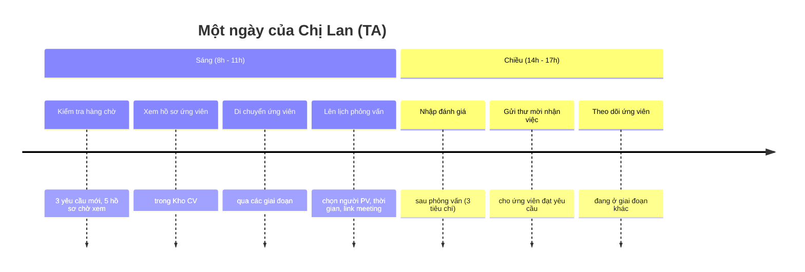
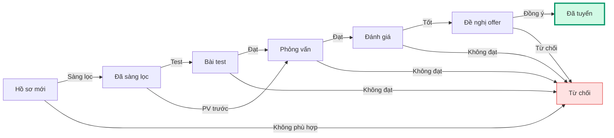

<Card>
  **👤 Chị Lan** — Chuyên viên Tuyển dụng

  _"Mình dành phần lớn thời gian để tìm ứng viên phù hợp và đảm bảo họ có trải nghiệm tốt với công ty."_
</Card>

## Bạn cần biết (3 điểm chính)

1. **Bạn xử lý các yêu cầu được phân công** — Sau khi HRD duyệt và phân công, bạn chịu trách nhiệm từ A-Z
2. **Bạn di chuyển ứng viên qua các giai đoạn** — Bằng cách kéo thẻ trong hệ thống
3. **Bạn không duyệt đơn** — Chỉ HRD, sếp phòng và Ban Giám đốc mới duyệt

<Note>
  **Bạn KHÔNG cần biết:** cách hệ thống lưu trữ dữ liệu, các quy tắc duyệt nội bộ, cách phân bổ ngân sách.
</Note>

## Một ngày của bạn

### Quy trình xử lý ứng viên

### 5 việc bạn làm thường xuyên

| Việc | Bạn làm gì | Thời gian trung bình |
| --- | --- | --- |
| 🔍 **Tìm ứng viên** | Dùng ô tìm kiếm thông minh (gõ 2\+ ký tự) trong Kho CV | 15-30 phút/ngày |
| 📅 **Lên lịch PV** | Kéo thẻ ứng viên sang giai đoạn "Phỏng vấn", điền form | 5-10 phút/lịch |
| ✍️ **Nhập đánh giá** | Sau PV, mở bảng điểm 3 phần (Chuyên môn/Văn hóa/Thái độ) | 10-15 phút/ứng viên |
| 💌 **Gửi offer** | Kéo thẻ sang "Đề nghị", điền mức lương, ngày bắt đầu | 5 phút |
| 📊 **Theo dõi tiến trình** | Xem bảng Kanban để biết ứng viên nào đang ở đâu | Liên tục |

<Tip>
  🎯 **Bạn là người "chạy" yêu cầu tuyển dụng.** Sau khi HRD duyệt, bạn xử lý từ tìm ứng viên → phỏng vấn → gửi offer → tuyển thành công. Hệ thống giúp bạn theo dõi mọi ứng viên, không sợ quên ai.
</Tip>