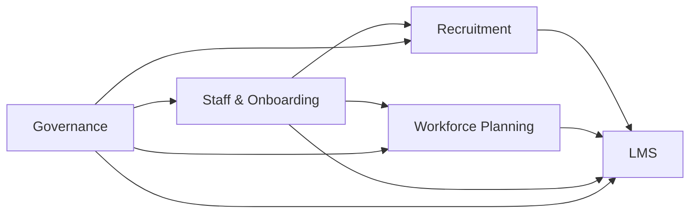

# Tổng quan hệ thống

Appota HRM được tổ chức thành **4 nhóm module chính**, mỗi nhóm phục vụ một nhóm người dùng và một bài toán nghiệp vụ rõ ràng.

## Nhóm 1 — Staff & Onboarding

Quản lý vòng đời nhân viên từ lúc mời nhập công ty đến khi nghỉ việc.

<Columns cols={2}>
  <Card title="Onboarding Form" icon="file-pen" href="/modules/staff/onboarding">
    Form 3 bước cho ứng viên mới: thông tin cá nhân, liên hệ & kinh nghiệm, xác nhận.
  </Card>

  <Card title="HR Review" icon="user-check" href="/modules/staff/hr-review">
    HR xét duyệt hồ sơ, phân công phòng ban, loại hợp đồng và job title.
  </Card>

  <Card title="Staff List 4 cấp" icon="sitemap" href="/modules/staff/staff-list">
    Drill-down Tập đoàn → Công ty con → Phòng ban → Nhân viên với KPI cards.
  </Card>

  <Card title="Staff Detail" icon="id-card" href="/modules/staff/staff-detail">
    Hồ sơ cá nhân, activity timeline và 11 tab (CV, Time Off, Capability Map, v.v.).
  </Card>
</Columns>

## Nhóm 2 — Recruitment

Pipeline tuyển dụng chuẩn hoá gồm **5 module A-E** với AI hỗ trợ matching.

<Columns cols={2}>
  <Card title="Recruitment Orders" icon="clipboard-list" href="/modules/recruitment/recruitment-orders">
    Module A — Leader tạo yêu cầu tuyển dụng, HR duyệt, JD chuyển trạng thái "Được phép tuyển".
  </Card>

  <Card title="CV Pool" icon="address-book" href="/modules/recruitment/cv-pool">
    Module B — Quản lý 30\+ CV với table view, kanban drag-drop, import batch và AI matching.
  </Card>

  <Card title="JD Pool" icon="file-contract" href="/modules/recruitment/jd-pool">
    Quản lý 15\+ JD với JD Status, danh sách CV đã apply và AI matching ngược.
  </Card>

  <Card title="Interviews" icon="video" href="/modules/recruitment/interviews">
    Module C — Lịch phỏng vấn, video recording, transcript, AI evaluation và chấm điểm theo tiêu chí.
  </Card>
</Columns>

## Nhóm 3 — Workforce Planning

Theo dõi kế hoạch nhân sự và hiệu suất tuyển dụng.

<Columns cols={3}>
  <Card title="Dashboard" icon="chart-pie" href="/modules/workforce/dashboard">
    KPI tổng công ty, bảng tổng hợp 8 phòng ban, biểu đồ headcount & ngân sách.
  </Card>

  <Card title="Department Detail" icon="building" href="/modules/workforce/department-detail">
    Chi tiết headcount, ngân sách, time-to-fill và nguồn tuyển hiệu quả nhất.
  </Card>

  <Card title="JD Management" icon="file-lines" href="/modules/workforce/jd-management">
    Quản lý vị trí tuyển dụng và đồng bộ với recruitment order.
  </Card>
</Columns>

## Nhóm 4 — LMS (Learning Management System)

Đào tạo nội bộ với 6 module con: Courses, Materials, Quizzes, Progress, Training Plans, Training Reports.

<Columns cols={3}>
  <Card title="Courses" icon="book" href="/modules/lms/courses">
    Tạo và quản lý 15-20 khóa học với học liệu \+ bài test theo thứ tự.
  </Card>

  <Card title="Quizzes" icon="circle-question" href="/modules/lms/quizzes">
    Bài test trắc nghiệm tự động chấm điểm với điểm đạt có thể cấu hình.
  </Card>

  <Card title="Training Reports" icon="chart-column" href="/modules/lms/training-reports">
    Dashboard KPI \+ báo cáo chi tiết theo phòng ban / khóa học.
  </Card>
</Columns>

## Nhóm 5 — Governance

Quản trị hệ thống: phân quyền, audit log và cài đặt.

<Columns cols={3}>
  <Card title="Permissions" icon="key" href="/modules/permissions/overview">
    9 role, 24 permission, 25-30 policy với access matrix và department boundary.
  </Card>

  <Card title="Audit Trail" icon="clock-rotate-left" href="/modules/permissions/audit-trail">
    150-200 audit entry với AI risk assessment và timeline/table view.
  </Card>

  <Card title="Settings" icon="gear" href="/modules/settings">
    Capability Dictionary, Jobsite Templates và các tuỳ chỉnh hệ thống.
  </Card>
</Columns>

## Quy trình nghiệp vụ cốt lõi

<Steps>
  <Step title="Onboarding nhân viên mới">
    Leader mời ứng viên bằng link có token → ứng viên điền form → HR duyệt → nhân viên xuất hiện trong Staff List.
  </Step>
  <Step title="Tuyển dụng">
    Leader tạo Recruitment Order → HR approve → JD chuyển "Được phép tuyển" → Recruiter xử lý CV Pool → Interview → Offer.
  </Step>
  <Step title="Workforce planning">
    HR/Lãnh đạo theo dõi headcount, ngân sách, time-to-fill và cảnh báo phòng chậm tiến độ.
  </Step>
  <Step title="Đào tạo nội bộ">
    HR/Trainer tạo khóa học → gán cho nhân viên / phòng ban → nhân viên học → chứng chỉ tự động cấp.
  </Step>
  <Step title="Quản trị & tuân thủ">
    Mọi thao tác được ghi audit log → AI đánh giá risk → xuất báo cáo khi cần.
  </Step>
</Steps>