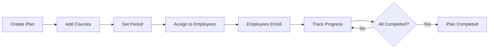

# LMS — Training Plans

**Route:** `/lms/training-plans`

Quản lý kế hoạch đào tạo theo phòng ban và chu kỳ (tháng/quý/năm).

## Plan List

| Cột | Mô tả |
| --- | --- |
| Tên kế hoạch | — |
| Phòng ban | — |
| Chu kỳ | Tháng / Quý / Năm |
| Số khóa học | Tổng khóa học trong kế hoạch |
| Trạng thái | Active, Completed, Cancelled |
| Ngày bắt đầu | — |
| Ngày kết thúc | — |

### Bộ lọc

- Phòng ban
- Chu kỳ
- Trạng thái

### Hành động

- **Tạo kế hoạch mới**
- Click vào kế hoạch → Plan Detail

## Create / Edit Plan

### Form

<ParamField path="name" type="string" required>
  Tên kế hoạch
</ParamField>

<ParamField path="description" type="textarea">
  Mô tả
</ParamField>

<ParamField path="departments" type="string[]" required>
  Phòng ban áp dụng (multi-select)
</ParamField>

<ParamField path="period" type="select" required>
  Tháng, Quý, Năm
</ParamField>

<ParamField path="startDate" type="date" required>
  Ngày bắt đầu
</ParamField>

<ParamField path="endDate" type="date" required>
  Ngày kết thúc
</ParamField>

<ParamField path="courses" type="string[]" required>
  Danh sách khóa học (chọn từ Course List)
</ParamField>

<ParamField path="courseOrder" type="string[]">
  Thứ tự khóa học
</ParamField>

### Hành động

- **Save** → Lưu kế hoạch
- **Cancel** → Hủy

## Plan Detail

### Header

- Tên kế hoạch
- Phòng ban
- Chu kỳ
- Trạng thái
- Ngày bắt đầu / kết thúc

### Danh sách khóa học

Hiển thị theo thứ tự. Mỗi khóa học:

- Tên
- Số học viên được gán
- Tỷ lệ hoàn thành (%)

### Danh sách nhân viên được gán

| Cột | Mô tả |
| --- | --- |
| Tên | — |
| Phòng ban | — |
| Tiến độ tổng thể (%) | Trung bình các khóa học |
| Số khóa học hoàn thành / Tổng | — |

### Hành động

- **Edit Plan**
- **Assign to Employees** → Gán kế hoạch cho nhân viên hoặc phòng ban

## Workflow

## Validation

| Trường hợp | Xử lý |
| --- | --- |
| Không có kế hoạch | Hiển thị **"No training plans found"** |
| Thiếu thông tin bắt buộc | Hiển thị lỗi, yêu cầu điền đầy đủ |

## Mock Data

<Note>
  - 5-10 kế hoạch đào tạo
  - Đa dạng chu kỳ: Tháng (phổ biến nhất), Quý, Năm
  - Mỗi kế hoạch: 3-5 khóa học
</Note>

## Liên kết

<CardGroup cols={3}>
  <Card title="Courses" icon="book" href="/modules/lms/courses">
    Khóa học trong kế hoạch.
  </Card>

  <Card title="Learning Progress" icon="chart-line" href="/modules/lms/learning-progress">
    Tiến độ từng nhân viên.
  </Card>

  <Card title="Training Reports" icon="chart-column" href="/modules/lms/training-reports">
    Báo cáo.
  </Card>
</CardGroup>