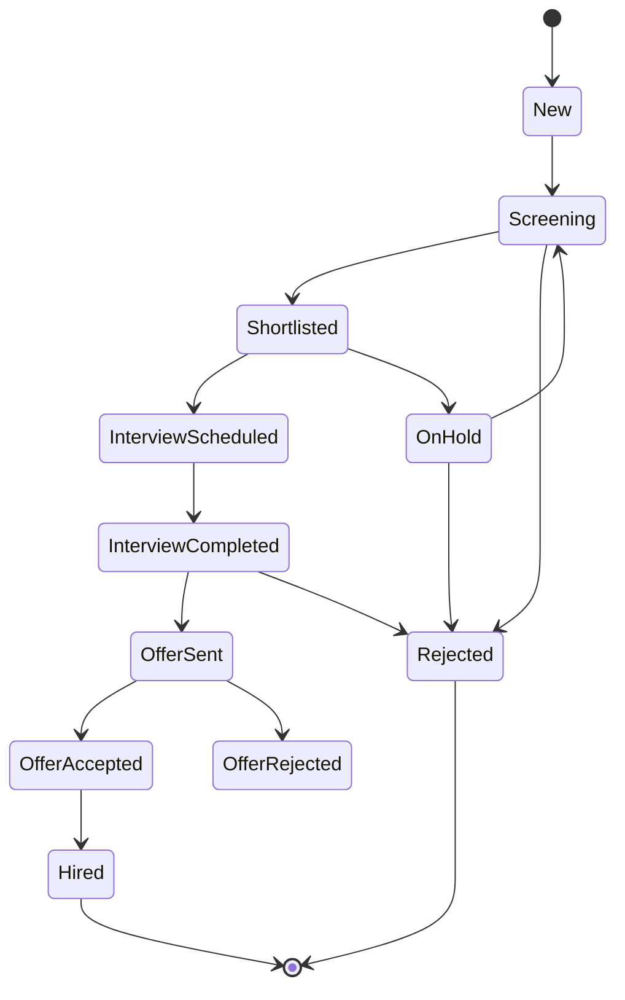

# CV Pool

**Route:** `/cv-pool`

CV Pool lưu trữ và quản lý toàn bộ CV ứng viên trong hệ thống, hỗ trợ tìm kiếm, matching với JD, theo dõi changelog và approval records.

## Các view chính

<CardGroup cols={3}>
  <Card title="Table View" icon="table" href="#table-view">
    Bảng danh sách CV với filter nâng cao.
  </Card>

  <Card title="Kanban" icon="columns" href="#kanban">
    Drag-drop CV theo trạng thái.
  </Card>

  <Card title="Import CV" icon="file-import" href="#import-cv">
    Upload batch CSV/Excel với dedup.
  </Card>
</CardGroup>

## Trạng thái CV (Module B1 — P1)



Xem chi tiết transition map tại [CV Status Transitions](/business-rules/cv-status-transitions).

## Table View

Mỗi CV card hiển thị:

- Ảnh avatar
- Tên ứng viên
- Vị trí apply
- Công ty/phòng ban ứng tuyển (Gamota, Adsota, Kdata, OTA, Appota Holding)
- Ngày apply
- Trạng thái
- **Điểm matching AI (%)**
- Tags kỹ năng
- Số lần được review

### Bộ lọc nâng cao

<ParamField path="dateRange" type="date-range">
  Khoảng thời gian apply
</ParamField>

<ParamField path="position" type="string">
  Vị trí / JD đã apply
</ParamField>

<ParamField path="status" type="select">
  Tất cả trạng thái CV
</ParamField>

<ParamField path="company" type="select">
  Gamota, Adsota, Kdata, OTA, Appota Holding
</ParamField>

<ParamField path="skills" type="string[]">
  Tags kỹ năng (multi-select)
</ParamField>

<ParamField path="experience" type="number">
  Số năm kinh nghiệm tối thiểu
</ParamField>

<ParamField path="education" type="select">
  High School, Bachelor, Master, PhD
</ParamField>

<ParamField path="search" type="string">
  Tìm theo tên, email, kỹ năng, vị trí
</ParamField>

## AI Matching Panel

Nút **Tìm CV phù hợp với JD** mở dialog chọn JD hiện tại:

```typescript
interface MatchingResult {
  cvId: string;
  candidateName: string;
  matchScore: number;          // 0-100%
  matchReasons: MatchBadge[];  // ['Kỹ năng phù hợp 90%', 'Kinh nghiệm tương đồng']
}

interface MatchBadge {
  type: 'skills' | 'experience' | 'education' | 'previousPosition';
  label: string;
  weight: number; // %
}
```

### Quy trình

<Steps>
  <Step title="Chọn JD">
    Mở dialog → chọn 1 JD hiện tại cần tìm ứng viên.
  </Step>
  <Step title="AI quét pool">
    AI quét toàn bộ CV Pool và tính điểm matching.
  </Step>
  <Step title="Hiển thị top 10">
    Hiển thị top 10 CV phù hợp nhất với điểm % và badge lý do.
  </Step>
  <Step title="Thêm vào shortlist">
    Click **Thêm vào shortlist** → trigger approval flow.
  </Step>
</Steps>

Xem chi tiết AI matching logic tại [Business Rules](/business-rules/cv-status-transitions).

## Kanban View

Mỗi **column** tương ứng một trạng thái CV. Mỗi **card** hiển thị:

- Tên ứng viên
- Nguồn CV (LinkedIn, Indeed, VietnamWorks, Referral)
- Ngày cập nhật gần nhất
- Tags kỹ năng
- Lịch phỏng vấn gần nhất (nếu có)

### Drag-drop

<Steps>
  <Step title="Kéo CV từ column này sang column khác">
  </Step>
  <Step title="Validate transition rule">
    Hệ thống kiểm tra transition map.
  </Step>
  <Step title="Nếu hợp lệ">
    Gọi API chuyển trạng thái và ghi log.
  </Step>
  <Step title="Nếu không hợp lệ">
    Hiển thị **"Invalid transition"** — không cho phép chuyển.
  </Step>
</Steps>

## CV Detail

Hiển thị dạng **dialog** hoặc **side panel** với:

### Thông tin cá nhân

- Tên, email, số điện thoại
- Địa chỉ, ngày sinh

### Tóm tắt CV

- AI generated summary

### Kỹ năng

- Tags kỹ năng
- Mapping với Capability Dictionary

### Lịch sử apply

Timeline các lần ứng tuyển: JD nào, ngày nào, kết quả.

### Lịch sử đánh giá của recruiter

Mỗi lần review:

- Tên recruiter
- Ngày review
- Điểm (1-5 sao)
- Nhận xét text
- Kết quả quyết định (Pass/Reject/Hold)

### Changelog / Activity Timeline

Lọc theo loại: `All`, `Status Change`, `Note`, `Interview`, `Approval`.

### Approval Records

Thao tác nhạy cảm cần approval:

- Shortlist
- Chuyển vòng phỏng vấn
- Gửi offer
- Reject

Mỗi record: `Pending`, `Approved`, hoặc `Rejected` với requestor, approver, timestamp, reason.

### Hành động

- **Thêm nhận xét mới**
- **Đề xuất cho JD**
- **Lưu vào shortlist** (trigger approval)
- **Chuyển trạng thái** (validate rule \+ log)

## Import CV

### Upload Section

- Chấp nhận: **CSV**, **Excel**
- Template download link

### Processing

<Steps>
  <Step title="Parse file">
    Hệ thống parse file CSV/Excel.
  </Step>
  <Step title="Dedup">
    Dedup theo: email, phone, link, hash.
  </Step>
  <Step title="Validate">
    Validate từng field dữ liệu.
  </Step>
  <Step title="Summary">
    Hiển thị: Total / Created / Duplicated / Failed.
  </Step>
  <Step title="Review trùng lặp">
    Bảng so sánh CV mới vs CV cũ side-by-side.

    - **Merge**: gộp thông tin
    - **Skip**: bỏ qua
    - **Create Anyway**: tạo mới bất chấp trùng
  </Step>
  <Step title="Fix lỗi">
    Bảng lỗi với field nào bị lỗi, lý do → fix và retry.
  </Step>
</Steps>

## Mock Data

<Note>
  - 30\+ CV ứng viên đa dạng ngành nghề
  - Apply từ 2021-2026
  - Mỗi CV có 1-3 lần review
  - Đa dạng trạng thái: New → ... → Hired / Rejected / On Hold
  - Tags kỹ năng phong phú (React, Node.js, Python, Figma, SEO, v.v.)
  - Công ty: Gamota, Adsota, Kdata, OTA, Appota Holding
</Note>

## Liên kết

<CardGroup cols={2}>
  <Card title="JD Pool" icon="file-contract" href="/modules/recruitment/jd-pool">
    JD để match CV ngược.
  </Card>

  <Card title="Interviews" icon="video" href="/modules/recruitment/interviews">
    Phỏng vấn cho CV ở trạng thái Interview Scheduled.
  </Card>

  <Card title="Capability Dictionary" icon="book" href="/modules/settings">
    Mapping skill text → skill chuẩn.
  </Card>
</CardGroup>