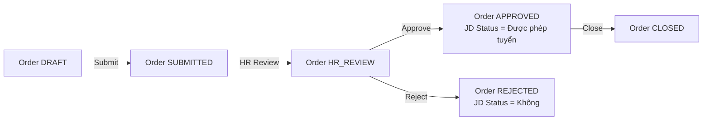

# JD Pool

**Route:** `/jd-pool`

JD Pool quản lý tất cả Job Description trong hệ thống, kèm danh sách CV đã apply và **AI matching ngược** để tìm CV phù hợp từ pool cũ.

## JD Status

Mỗi JD có **2 trạng thái chính**:

<CardGroup cols={2}>
  <Card title="Được phép tuyển" color="#16a34a" icon="check">
    Cho phép tạo InterviewSession, chuyển stage phỏng vấn/offer.
  </Card>

  <Card title="Không được phép tuyển" color="#dc2626" icon="ban">
    API trả lỗi `JD_NOT_ALLOWED` khi thực hiện thao tác không được phép.
  </Card>
</CardGroup>

JD Status được đồng bộ với **Recruitment Order**:



Xem chi tiết tại [JD Status Rules](/business-rules/jd-status-rules).

## JD List

Mỗi JD card hiển thị:

- Tên vị trí
- Công ty/phòng ban
- Trạng thái (`Open` / `Closed` / `Draft` / `Archived`)
- JD Status
- Ngày tạo
- Ngày đóng (nếu có)
- Số CV đã nhận
- Số CV trong pipeline hiện tại
- Số vị trí cần tuyển / đã tuyển

### Bộ lọc

<ParamField path="status" type="select">
  Open, Closed, Draft, Archived
</ParamField>

<ParamField path="jdStatus" type="select">
  Được phép tuyển, Không được phép tuyển
</ParamField>

<ParamField path="company" type="select">
  Gamota, Adsota, Kdata, OTA, Appota Holding, Appota Group
</ParamField>

<ParamField path="contractType" type="select">
  Full-time, Part-time, Contractor, Intern
</ParamField>

<ParamField path="dateRange" type="date-range">
  Khoảng thời gian tạo
</ParamField>

## JD Detail

Hiển thị:

- Mô tả đầy đủ vị trí
- Yêu cầu kỹ năng (tags)
- Timeline tuyển dụng
- Danh sách CV đã apply → link sang **CV Pool** để xem chi tiết

### Hành động

<Card title="Tìm CV phù hợp từ pool cũ" icon="magnifying-glass">
  Trigger **AI matching ngược** — quét toàn bộ CV Pool và trả về top 10 CV phù hợp nhất.
</Card>

## AI Matching ngược

### Dialog AI Matching

<Steps>
  <Step title="Chọn JD">
    JD đã chọn được highlight.
  </Step>
  <Step title="AI quét CV Pool">
    Quét toàn bộ CV với 4 tiêu chí:

    - **Skills** — kỹ năng khớp
    - **Experience** — số năm kinh nghiệm
    - **Education** — học vấn
    - **Previous Position** — vị trí apply cũ
  </Step>
  <Step title="Hiển thị top 10">
    Ranked list với badge lý do phù hợp.
  </Step>
  <Step title="Thêm vào shortlist">
    Click **Thêm vào shortlist** cho từng CV → trigger approval flow.
  </Step>
</Steps>

### Matching dựa trên

```typescript
interface MatchScore {
  total: number;            // 0-100%
  breakdown: {
    skills: number;         // %
    experience: number;     // %
    education: number;      // %
    previousPosition: number; // %
  };
  reasons: string[];        // ['Kỹ năng phù hợp 90%', 'Kinh nghiệm tương đồng']
}
```

## Mock Data

<Note>
  - 15\+ JD bao gồm cả đã đóng và đang mở
  - Trạng thái: Open, Closed, Draft, Archived
  - JD Status: Được phép tuyển, Không được phép tuyển
  - Mỗi JD có danh sách CV đã apply
  - Yêu cầu kỹ năng dạng tags (React, Node.js, Java, Python, v.v.)
</Note>

## Edge Cases

| Tình huống | Xử lý |
| --- | --- |
| JD Status = Không được phép tuyển | Hiển thị banner cảnh báo trên JD Detail |
| Tạo InterviewSession cho JD không được phép | API trả lỗi `JD_NOT_ALLOWED` |
| Chuyển stage phỏng vấn/offer cho JD không được phép | API trả lỗi `JD_NOT_ALLOWED` |
| JD chưa có CV apply | Hiển thị **"No CVs applied yet"** |
| AI Matching không tìm thấy CV phù hợp | Hiển thị **"No matching CVs found for this JD"** |

## Liên kết

<CardGroup cols={2}>
  <Card title="CV Pool" icon="address-book" href="/modules/recruitment/cv-pool">
    Quản lý CV ứng viên.
  </Card>

  <Card title="Recruitment Orders" icon="clipboard-list" href="/modules/recruitment/recruitment-orders">
    JD Status đồng bộ với Order.
  </Card>

  <Card title="JD Status Rules" icon="gavel" href="/business-rules/jd-status-rules">
    Quy tắc nghiệp vụ JD Status.
  </Card>
</CardGroup>