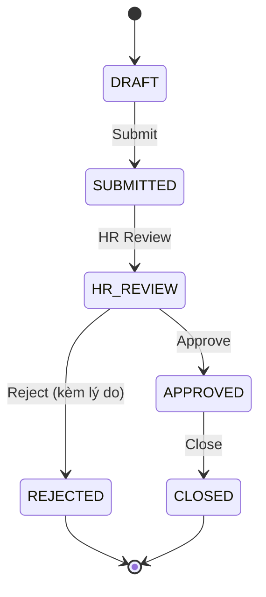

# Recruitment Orders

**Route:** `/recruitment/orders`

Quản lý yêu cầu tuyển dụng từ khi Leader tạo nháp cho đến khi HR phê duyệt. Mọi thay đổi trạng thái đều được ghi audit log đầy đủ.

## Trạng thái Order



<Note>
  Khi **HR Approve**, JD Status chuyển sang **"Được phép tuyển"** — cho phép tạo InterviewSession và chuyển stage phỏng vấn/offer. Xem chi tiết tại [JD Status Rules](/business-rules/jd-status-rules).
</Note>

## Order List

| Cột | Mô tả |
| --- | --- |
| Order ID | Mã yêu cầu |
| Tên vị trí | Vị trí cần tuyển |
| Phòng ban | Department |
| Số lượng | Số lượng cần tuyển |
| Trạng thái | `DRAFT` / `SUBMITTED` / `HR_REVIEW` / `APPROVED` / `REJECTED` / `CLOSED` |
| JD Status | `Được phép tuyển` / `Không được phép tuyển` |
| Ngày tạo | Thời điểm tạo |
| Người tạo | Leader tạo |
| Ngày submit | Thời điểm submit |

### Bộ lọc

- Trạng thái Order
- JD Status
- Phòng ban
- Khoảng thời gian

## Create Order

**Route:** `/recruitment/orders` → click **Tạo yêu cầu mới**

Form tạo yêu cầu:

<ParamField path="position" type="string" required>
  Tên vị trí (ví dụ: Senior Backend Engineer)
</ParamField>

<ParamField path="department" type="select" required>
  Engineering, Marketing, Sales, HR, Finance, Operations, Design, Product
</ParamField>

<ParamField path="quantity" type="number" required>
  Số lượng cần tuyển (1-20)
</ParamField>

<ParamField path="description" type="textarea">
  Mô tả công việc chi tiết
</ParamField>

<ParamField path="skills" type="string[]">
  Yêu cầu kỹ năng (tags)
</ParamField>

<ParamField path="budget" type="number">
  Mức lương dự kiến (VND)
</ParamField>

<ParamField path="deadline" type="date">
  Thời gian dự kiến hoàn thành
</ParamField>

<ParamField path="reason" type="textarea">
  Lý do tuyển dụng
</ParamField>

### Hành động

<CardGroup cols={2}>
  <Card title="Save as Draft" icon="floppy-disk">
    Lưu nháp với status `DRAFT`. Có thể edit sau.
  </Card>

  <Card title="Submit" icon="paper-plane">
    Gửi cho HR review. Status chuyển `DRAFT → SUBMITTED`.
  </Card>
</CardGroup>

## Order Detail

**Route:** `/recruitment/orders/:id`

### Header

- Order ID
- Tên vị trí
- Trạng thái hiện tại
- JD Status
- Ngày tạo \+ Người tạo

### Audit Log

Timeline hiển thị lịch sử thay đổi:

```text
[2026-05-20 10:30] Nguyễn Văn A: DRAFT → SUBMITTED
[2026-05-20 14:15] HR Trần Thị B: SUBMITTED → HR_REVIEW
[2026-05-21 09:00] HR Trần Thị B: HR_REVIEW → APPROVED
                    JD Status → Được phép tuyển
```

### Hành động theo trạng thái

| Trạng thái | Hành động khả dụng |
| --- | --- |
| `DRAFT` | Edit, Submit |
| `SUBMITTED` | HR Review |
| `HR_REVIEW` | Approve, Reject (kèm lý do) |
| `APPROVED` | Close |
| `REJECTED` | (Không có) |
| `CLOSED` | (Không có) |

<Warning>
  **Edit** chỉ khả dụng khi status là `DRAFT`. Sau khi submit, không thể chỉnh sửa thông tin. Hệ thống hiển thị lỗi **"Cannot edit order in current status"** nếu cố edit.
</Warning>

## Quy tắc nghiệp vụ

<Steps>
  <Step title="Leader tạo order">
    Status `DRAFT`. Leader có toàn quyền edit.
  </Step>
  <Step title="Leader submit">
    Status `DRAFT → SUBMITTED`. Không thể edit nữa.
  </Step>
  <Step title="HR review">
    Status `SUBMITTED → HR_REVIEW`.
  </Step>
  <Step title="HR approve">
    Status `HR_REVIEW → APPROVED`. JD Status = `Được phép tuyển`. Cho phép tạo InterviewSession.
  </Step>
  <Step title="HR reject">
    Status `HR_REVIEW → REJECTED`. Yêu cầu nhập lý do (lưu vào audit log).
  </Step>
  <Step title="Close">
    Khi hoàn thành tuyển dụng → `APPROVED → CLOSED`.
  </Step>
</Steps>

## Mock Data

<Note>
  - 10\+ recruitment order với đa dạng trạng thái
  - Audit log đầy đủ cho mỗi order
  - Tất cả companies thành viên: Gamota, Adsota, Kdata, OTA, Appota Holding
</Note>

## Liên kết

<CardGroup cols={2}>
  <Card title="JD Pool" icon="file-contract" href="/modules/recruitment/jd-pool">
    Quản lý JD được liên kết với order.
  </Card>

  <Card title="CV Pool" icon="address-book" href="/modules/recruitment/cv-pool">
    Ứng viên từ CV Pool được match với order.
  </Card>

  <Card title="Interviews" icon="video" href="/modules/recruitment/interviews">
    Lịch phỏng vấn sau khi order được approve.
  </Card>
</CardGroup>