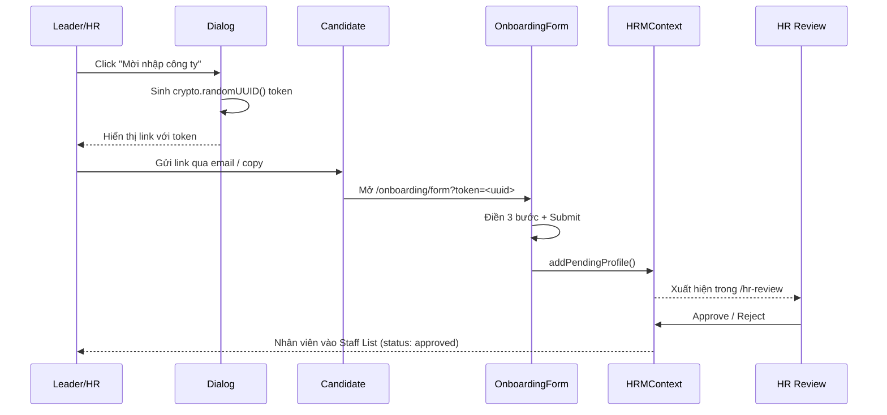

# Onboarding

Module Onboarding cho phép ứng viên mới **tự điền hồ sơ cá nhân** thông qua form 3 bước, sau đó gửi về HR để phê duyệt.

## Hai view chính

<CardGroup cols={2}>
  <Card title="HR View" icon="user-tie" href="/modules/staff/onboarding">
    HR xem danh sách ứng viên, mời qua InviteDialog với token bảo mật.
  </Card>

  <Card title="Candidate View" icon="user" href="/modules/staff/onboarding#form-3-bc">
    Ứng viên điền form 3 bước và submit.
  </Card>
</CardGroup>

## Data Flow



## Form 3 bước

<Steps>
  <Step title="Bước 1 — Thông tin cá nhân">
    - Họ tên
    - Ngày sinh
    - Giới tính
    - Quốc tịch
    - Avatar (upload)
  </Step>
  <Step title="Bước 2 — Liên hệ & Kinh nghiệm">
    - Địa chỉ
    - Email
    - Số điện thoại
    - Thông tin gia đình (dependants)
    - Kinh nghiệm làm việc
  </Step>
  <Step title="Bước 3 — Preferences & Xác nhận">
    - Job titles mong muốn
    - Work location
    - Curriculum / CV đính kèm
    - Xác nhận thông tin và Submit
  </Step>
</Steps>

## InviteDialog (HR view)

Khi HR click **"Mời nhập công ty"**:

```typescript title="HRMContext.tsx"
const token = crypto.randomUUID();
const inviteLink = `${origin}/onboarding/form?token=${token}`;

// Toast: "Đã tạo link mời"
// Copy link hoặc gửi qua email
```

<Note>
  Token được sinh bằng `crypto.randomUUID()` — không lưu vào database, chỉ dùng để định danh ứng viên khi submit form.
</Note>

## Validation

| Trường hợp | Xử lý |
| --- | --- |
| Submit thiếu thông tin bắt buộc | Hiển thị thông báo lỗi, yêu cầu điền đầy đủ |
| Upload avatar không đúng định dạng | Hiển thị thông báo lỗi |
| Email không hợp lệ | Validation phía client (Zod) |
| Số điện thoại không hợp lệ | Validation phía client (Zod) |

## Trạng thái hồ sơ

```typescript
type StaffStatus = 'Pending' | 'Under Review' | 'Approved' | 'Rejected';
```

- **Pending**: Mới submit form, chưa được xem xét
- **Under Review**: HR đang xem xét
- **Approved**: Đã phê duyệt, nhân viên chính thức
- **Rejected**: Bị từ chối (kèm lý do)

## Liên kết

<CardGroup cols={3}>
  <Card title="HR Review" icon="user-check" href="/modules/staff/hr-review">
    Bước tiếp theo sau khi ứng viên submit.
  </Card>

  <Card title="Staff List" icon="users" href="/modules/staff/staff-list">
    Nhân viên approved xuất hiện ở đây.
  </Card>

  <Card title="Quy trình đầy đủ" icon="diagram-project" href="/business-rules/onboarding-flow">
    Business rule chi tiết cho flow onboarding.
  </Card>
</CardGroup>