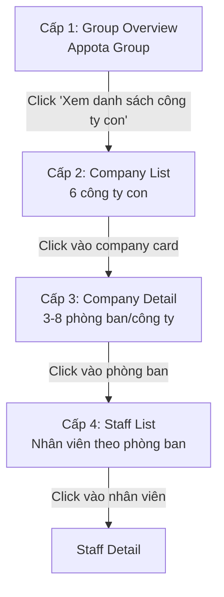

# Staff — Tổng quan 4 cấp

Module Staff triển khai mô hình **drill-down 4 cấp** với transition mượt mà, KPI cards, mini chart và breadcrumb động.

## 4 cấp quản lý

## Cấp 1 — Group Overview

**Route:** `/staff`

Khi truy cập `/staff`, mặc định hiển thị **Cấp 1 — Group Overview** với breadcrumb `Appota Group`.

### KPI Cards (4 cards ngang)

- Tổng nhân viên toàn tập đoàn
- Số công ty con
- Số phòng ban (tổng tất cả công ty)
- Tuyển mới tháng này

### Hành động

<Steps>
  <Step title="Xem thông tin tập đoàn">
    Hiển thị tiêu đề **Appota Group** và mô tả ngắn.
  </Step>
  <Step title="Click 'Xem danh sách công ty con'">
    Chuyển sang **Cấp 2 — Company List**. Breadcrumb cập nhật: `Appota Group > Danh sách Công ty`.
  </Step>
</Steps>

## Cấp 2 — Company List

Hiển thị grid các **company card** với:

- Logo/Icon công ty
- Tên công ty (Appota Game, Appota Pay, Appota Cloud, Gamota, Adsota, Kdata, OTA, Appota Holding)
- Số nhân viên
- Số phòng ban
- Tăng trưởng (% so với tháng trước)
- Progress bar: tỉ lệ nhân viên công ty / tổng tập đoàn
- Badge trạng thái: `Active` / `Expanding` / `Stable`
- Mini bar chart: phân bổ nhân viên theo phòng ban

### Hành động

Click vào card công ty → chuyển sang **Cấp 3 — Company Detail**.

## Cấp 3 — Company Detail

Breadcrumb: `Appota Group > [Tên Công ty] > Danh sách Phòng ban`

### Header

- Logo công ty
- Tên công ty
- Tổng số nhân viên công ty
- Số phòng ban

### Danh sách phòng ban

Mỗi phòng ban (Engineering, Marketing, Sales, HR, Finance, Operations, Design, Product) hiển thị:

- Tên phòng ban
- Số nhân viên
- Department Head
- Progress bar: tỉ lệ nhân viên phòng ban / tổng công ty

### Hành động

<CardGroup cols={2}>
  <Card title="Click vào phòng ban" icon="arrow-right">
    Chuyển sang **Cấp 4 — Staff List** với filter phòng ban.
  </Card>

  <Card title="Click 'Xem tất cả nhân viên'" icon="users">
    Chuyển sang **Cấp 4 — Staff List** không filter phòng ban.
  </Card>
</CardGroup>

## Cấp 4 — Staff List

Breadcrumb: `Appota Group > [Tên Công ty] > [Tên Phòng ban] > Danh sách Nhân viên`

### Bảng nhân viên

| Cột | Mô tả |
| --- | --- |
| Avatar | Ảnh đại diện |
| Họ tên | Tên đầy đủ |
| Staff ID | Mã nhân viên |
| Department | Phòng ban |
| Contract Type | Loại hợp đồng |
| Job Title | Vị trí |
| Status | Trạng thái |

### Bộ lọc & tìm kiếm

- Filter theo **Department**
- Filter theo **Contract Type** (Full-time, Part-time, Contractor, Intern)
- Filter theo **Status** (Approved, Pending, Under Review, Rejected)
- Search theo **tên**

### Hành động

Click vào nhân viên → mở [**Staff Detail**](/modules/staff/staff-detail).

## Quy tắc nghiệp vụ

<Note>
  - Tổng nhân viên toàn tập đoàn: **800-1500**
  - Số công ty con: **5-8**
  - Số phòng ban tổng: **30-50**
  - Tuyển mới tháng này: **10-30**
  - Tăng trưởng mỗi công ty: **-5% đến \+20%**
</Note>

<Tip>
  Transition giữa các cấp sử dụng **loading state** hoặc **skeleton screen** để tránh lag. Click breadcrumb để quay lại cấp trước với transition mượt.
</Tip>