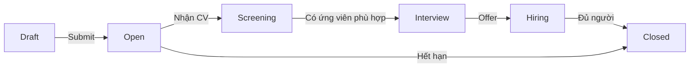

# JD Management

**Route:** `/jd` và `/jd-pool`

JD Management cho phép HR tạo, chỉnh sửa và quản lý các Job Description trong hệ thống. Có 2 cách tiếp cận:

<CardGroup cols={2}>
  <Card title="JD Pool" icon="file-contract" href="/modules/recruitment/jd-pool">
    Kho JD với AI matching — chi tiết hơn.
  </Card>
</CardGroup>

## Wizard tạo JD

**Component:** `CreateJDWizard`

Hướng dẫn HR tạo JD theo các bước:

<Steps>
  <Step title="Thông tin cơ bản">
    - Tên vị trí
    - Công ty/phòng ban
    - Loại hợp đồng
  </Step>
  <Step title="Mô tả công việc">
    - Mô tả chi tiết
    - Yêu cầu kỹ năng (tags)
    - Kinh nghiệm tối thiểu
  </Step>
  <Step title="Ngân sách & Timeline">
    - Mức lương dự kiến
    - Số lượng cần tuyển
    - Deadline dự kiến
  </Step>
  <Step title="Review & Submit">
    Xem lại toàn bộ → Save as Draft hoặc Submit để publish.
  </Step>
</Steps>

## JD Request Detail

**Component:** `JDRequestDetail`

Hiển thị chi tiết JD sau khi tạo:

- Thông tin đầy đủ
- Danh sách CV đã apply
- Timeline tuyển dụng
- Trạng thái JD

## Workflow

## Liên kết

<CardGroup cols={3}>
  <Card title="Recruitment Orders" icon="clipboard-list" href="/modules/recruitment/recruitment-orders">
    Order tạo JD với status "Được phép tuyển".
  </Card>

  <Card title="JD Pool" icon="file-contract" href="/modules/recruitment/jd-pool">
    Xem danh sách JD và matching.
  </Card>

  <Card title="CV Pool" icon="address-book" href="/modules/recruitment/cv-pool">
    CV ứng viên apply cho JD.
  </Card>
</CardGroup>